# Python ACL ベンチマーク

各実装を CPython / PyPy で比較します。グラフは小さいほど高速です。線は中央値、帯・ひげは観測された最小値から最大値です。正の値には対数軸を使い、0 を含む軸には線形軸を使います。

[HTML レポート](index.html) · [生データ](data/)

## Convolution \(mod 998244353\)

長さ n の 2 配列の畳み込み。FFT インスタンスの初期化・Python/C++ 間の変換も含む。

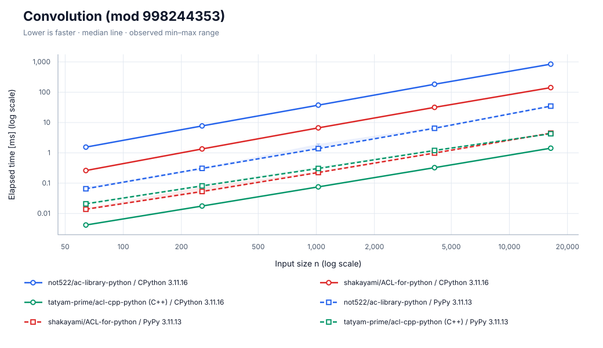

[SVG を保存](charts/convolution.svg)

| ランタイム | 計測日時 | CPU | repeat / warmup / seed | JSON |
| --- | --- | --- | --- | --- |
| CPython 3.11.16 | 2026-09-26T03:54:07.010710+00:00 | INTEL\(R\) XEON\(R\) PLATINUM 8573C | 5 / 3 / 42 | [data](data/cpython/convolution.json) |
| PyPy 3.11.13 | 2026-09-26T03:57:00.422087+00:00 | INTEL\(R\) XEON\(R\) PLATINUM 8573C | 5 / 3 / 42 | [data](data/pypy/convolution.json) |

- CPython 3.11.16: commit `5455c55e646f368af0159b1b3c85572a0af2ade9`; OS: Linux-6.17.0-1022-azure-x86\_64-with-glibc2.39
  - n=\[64, 256, 1024, 4096, 16384\]; warmup_seconds=0.25; sample_seconds=0.025
  - build: 3.11.16 \(main, Aug 13 2026, 02:46:14\) \[GCC 13.3.0\]
  - not522: https://github.com/not522/ac-library-python.git @ `27fdbb71cd0d566bdeb12746db59c9d908c6b5d5`
  - shakayami: https://github.com/shakayami/ACL-for-python.git @ `880ed3fc236c9628d674363768bcf203fbb84a8d`
  - tatyam: https://github.com/tatyam-prime/acl-cpp-python.git @ `b677fa437bdc1b0b7a4512d360de065cdca5778c`
- PyPy 3.11.13: commit `5455c55e646f368af0159b1b3c85572a0af2ade9`; OS: Linux-6.17.0-1022-azure-x86\_64-with-glibc2.39
  - n=\[64, 256, 1024, 4096, 16384\]; warmup_seconds=0.25; sample_seconds=0.025
  - build: 3.11.13 \(413c9b7f57f5, Jul 03 2025, 18:03:56\) \[PyPy 7.3.20 with GCC 10.2.1 20210130 \(Red Hat 10.2.1-11\)\]
  - not522: https://github.com/not522/ac-library-python.git @ `27fdbb71cd0d566bdeb12746db59c9d908c6b5d5`
  - shakayami: https://github.com/shakayami/ACL-for-python.git @ `880ed3fc236c9628d674363768bcf203fbb84a8d`
  - tatyam: https://github.com/tatyam-prime/acl-cpp-python.git @ `b677fa437bdc1b0b7a4512d360de065cdca5778c`

## Chinese remainder theorem

n 組の合同式を処理。各組は 4 個の法、最小公倍数を 64 bit 以内に固定。

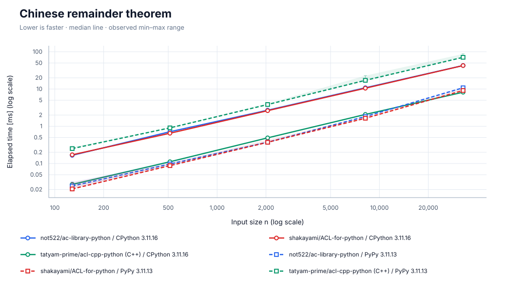

[SVG を保存](charts/crt.svg)

| ランタイム | 計測日時 | CPU | repeat / warmup / seed | JSON |
| --- | --- | --- | --- | --- |
| CPython 3.11.16 | 2026-09-26T03:54:14.335428+00:00 | INTEL\(R\) XEON\(R\) PLATINUM 8573C | 5 / 3 / 42 | [data](data/cpython/crt.json) |
| PyPy 3.11.13 | 2026-09-26T03:57:11.049917+00:00 | INTEL\(R\) XEON\(R\) PLATINUM 8573C | 5 / 3 / 42 | [data](data/pypy/crt.json) |

- CPython 3.11.16: commit `5455c55e646f368af0159b1b3c85572a0af2ade9`; OS: Linux-6.17.0-1022-azure-x86\_64-with-glibc2.39
  - n=\[128, 512, 2048, 8192, 32768\]; warmup_seconds=0.25; sample_seconds=0.025
  - build: 3.11.16 \(main, Aug 13 2026, 02:46:14\) \[GCC 13.3.0\]
  - not522: https://github.com/not522/ac-library-python.git @ `27fdbb71cd0d566bdeb12746db59c9d908c6b5d5`
  - shakayami: https://github.com/shakayami/ACL-for-python.git @ `880ed3fc236c9628d674363768bcf203fbb84a8d`
  - tatyam: https://github.com/tatyam-prime/acl-cpp-python.git @ `b677fa437bdc1b0b7a4512d360de065cdca5778c`
- PyPy 3.11.13: commit `5455c55e646f368af0159b1b3c85572a0af2ade9`; OS: Linux-6.17.0-1022-azure-x86\_64-with-glibc2.39
  - n=\[128, 512, 2048, 8192, 32768\]; warmup_seconds=0.25; sample_seconds=0.025
  - build: 3.11.13 \(413c9b7f57f5, Jul 03 2025, 18:03:56\) \[PyPy 7.3.20 with GCC 10.2.1 20210130 \(Red Hat 10.2.1-11\)\]
  - not522: https://github.com/not522/ac-library-python.git @ `27fdbb71cd0d566bdeb12746db59c9d908c6b5d5`
  - shakayami: https://github.com/shakayami/ACL-for-python.git @ `880ed3fc236c9628d674363768bcf203fbb84a8d`
  - tatyam: https://github.com/tatyam-prime/acl-cpp-python.git @ `b677fa437bdc1b0b7a4512d360de065cdca5778c`

## DSU / Union-Find

n 頂点・4n 回の merge / same。初期化と全クエリを計測。

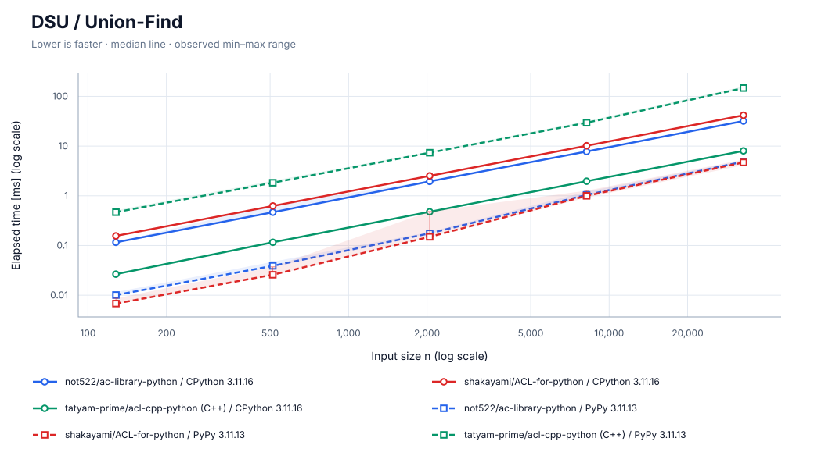

[SVG を保存](charts/dsu.svg)

| ランタイム | 計測日時 | CPU | repeat / warmup / seed | JSON |
| --- | --- | --- | --- | --- |
| CPython 3.11.16 | 2026-09-26T03:54:21.603508+00:00 | INTEL\(R\) XEON\(R\) PLATINUM 8573C | 5 / 3 / 42 | [data](data/cpython/dsu.json) |
| PyPy 3.11.13 | 2026-09-26T03:57:22.123702+00:00 | INTEL\(R\) XEON\(R\) PLATINUM 8573C | 5 / 3 / 42 | [data](data/pypy/dsu.json) |

- CPython 3.11.16: commit `5455c55e646f368af0159b1b3c85572a0af2ade9`; OS: Linux-6.17.0-1022-azure-x86\_64-with-glibc2.39
  - n=\[128, 512, 2048, 8192, 32768\]; warmup_seconds=0.25; sample_seconds=0.025
  - build: 3.11.16 \(main, Aug 13 2026, 02:46:14\) \[GCC 13.3.0\]
  - not522: https://github.com/not522/ac-library-python.git @ `27fdbb71cd0d566bdeb12746db59c9d908c6b5d5`
  - shakayami: https://github.com/shakayami/ACL-for-python.git @ `880ed3fc236c9628d674363768bcf203fbb84a8d`
  - tatyam: https://github.com/tatyam-prime/acl-cpp-python.git @ `b677fa437bdc1b0b7a4512d360de065cdca5778c`
- PyPy 3.11.13: commit `5455c55e646f368af0159b1b3c85572a0af2ade9`; OS: Linux-6.17.0-1022-azure-x86\_64-with-glibc2.39
  - n=\[128, 512, 2048, 8192, 32768\]; warmup_seconds=0.25; sample_seconds=0.025
  - build: 3.11.13 \(413c9b7f57f5, Jul 03 2025, 18:03:56\) \[PyPy 7.3.20 with GCC 10.2.1 20210130 \(Red Hat 10.2.1-11\)\]
  - not522: https://github.com/not522/ac-library-python.git @ `27fdbb71cd0d566bdeb12746db59c9d908c6b5d5`
  - shakayami: https://github.com/shakayami/ACL-for-python.git @ `880ed3fc236c9628d674363768bcf203fbb84a8d`
  - tatyam: https://github.com/tatyam-prime/acl-cpp-python.git @ `b677fa437bdc1b0b7a4512d360de065cdca5778c`

## Fenwick tree

n 要素・4n 回の一点加算 / 区間和。ゼロ初期化と全クエリを計測。

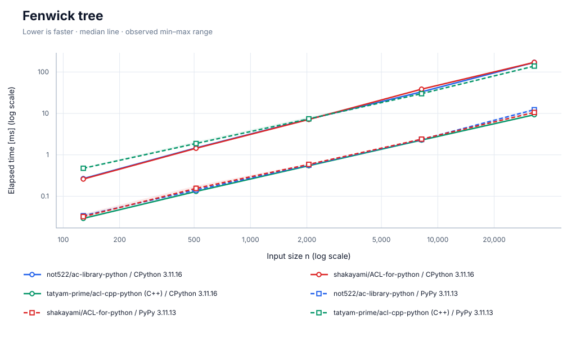

[SVG を保存](charts/fenwicktree.svg)

| ランタイム | 計測日時 | CPU | repeat / warmup / seed | JSON |
| --- | --- | --- | --- | --- |
| CPython 3.11.16 | 2026-09-26T03:54:31.628116+00:00 | INTEL\(R\) XEON\(R\) PLATINUM 8573C | 5 / 3 / 42 | [data](data/cpython/fenwicktree.json) |
| PyPy 3.11.13 | 2026-09-26T03:57:32.987311+00:00 | INTEL\(R\) XEON\(R\) PLATINUM 8573C | 5 / 3 / 42 | [data](data/pypy/fenwicktree.json) |

- CPython 3.11.16: commit `5455c55e646f368af0159b1b3c85572a0af2ade9`; OS: Linux-6.17.0-1022-azure-x86\_64-with-glibc2.39
  - n=\[128, 512, 2048, 8192, 32768\]; warmup_seconds=0.25; sample_seconds=0.025
  - build: 3.11.16 \(main, Aug 13 2026, 02:46:14\) \[GCC 13.3.0\]
  - not522: https://github.com/not522/ac-library-python.git @ `27fdbb71cd0d566bdeb12746db59c9d908c6b5d5`
  - shakayami: https://github.com/shakayami/ACL-for-python.git @ `880ed3fc236c9628d674363768bcf203fbb84a8d`
  - tatyam: https://github.com/tatyam-prime/acl-cpp-python.git @ `b677fa437bdc1b0b7a4512d360de065cdca5778c`
- PyPy 3.11.13: commit `5455c55e646f368af0159b1b3c85572a0af2ade9`; OS: Linux-6.17.0-1022-azure-x86\_64-with-glibc2.39
  - n=\[128, 512, 2048, 8192, 32768\]; warmup_seconds=0.25; sample_seconds=0.025
  - build: 3.11.13 \(413c9b7f57f5, Jul 03 2025, 18:03:56\) \[PyPy 7.3.20 with GCC 10.2.1 20210130 \(Red Hat 10.2.1-11\)\]
  - not522: https://github.com/not522/ac-library-python.git @ `27fdbb71cd0d566bdeb12746db59c9d908c6b5d5`
  - shakayami: https://github.com/shakayami/ACL-for-python.git @ `880ed3fc236c9628d674363768bcf203fbb84a8d`
  - tatyam: https://github.com/tatyam-prime/acl-cpp-python.git @ `b677fa437bdc1b0b7a4512d360de065cdca5778c`

## Floor sum

n 回の floor\_sum 呼び出し。引数 n,m は 1..999999、a,b は 0..999999。結果は符号付き 64 bit 以内。

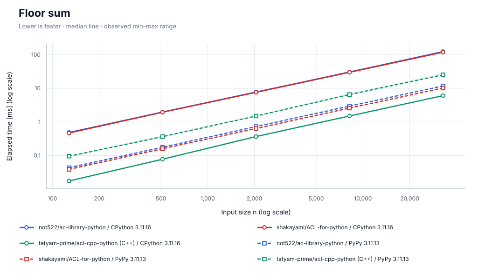

[SVG を保存](charts/floor_sum.svg)

| ランタイム | 計測日時 | CPU | repeat / warmup / seed | JSON |
| --- | --- | --- | --- | --- |
| CPython 3.11.16 | 2026-09-26T03:54:40.131993+00:00 | INTEL\(R\) XEON\(R\) PLATINUM 8573C | 5 / 3 / 42 | [data](data/cpython/floor_sum.json) |
| PyPy 3.11.13 | 2026-09-26T03:57:41.320316+00:00 | INTEL\(R\) XEON\(R\) PLATINUM 8573C | 5 / 3 / 42 | [data](data/pypy/floor_sum.json) |

- CPython 3.11.16: commit `5455c55e646f368af0159b1b3c85572a0af2ade9`; OS: Linux-6.17.0-1022-azure-x86\_64-with-glibc2.39
  - n=\[128, 512, 2048, 8192, 32768\]; warmup_seconds=0.25; sample_seconds=0.025
  - build: 3.11.16 \(main, Aug 13 2026, 02:46:14\) \[GCC 13.3.0\]
  - not522: https://github.com/not522/ac-library-python.git @ `27fdbb71cd0d566bdeb12746db59c9d908c6b5d5`
  - shakayami: https://github.com/shakayami/ACL-for-python.git @ `880ed3fc236c9628d674363768bcf203fbb84a8d`
  - tatyam: https://github.com/tatyam-prime/acl-cpp-python.git @ `b677fa437bdc1b0b7a4512d360de065cdca5778c`
- PyPy 3.11.13: commit `5455c55e646f368af0159b1b3c85572a0af2ade9`; OS: Linux-6.17.0-1022-azure-x86\_64-with-glibc2.39
  - n=\[128, 512, 2048, 8192, 32768\]; warmup_seconds=0.25; sample_seconds=0.025
  - build: 3.11.13 \(413c9b7f57f5, Jul 03 2025, 18:03:56\) \[PyPy 7.3.20 with GCC 10.2.1 20210130 \(Red Hat 10.2.1-11\)\]
  - not522: https://github.com/not522/ac-library-python.git @ `27fdbb71cd0d566bdeb12746db59c9d908c6b5d5`
  - shakayami: https://github.com/shakayami/ACL-for-python.git @ `880ed3fc236c9628d674363768bcf203fbb84a8d`
  - tatyam: https://github.com/tatyam-prime/acl-cpp-python.git @ `b677fa437bdc1b0b7a4512d360de065cdca5778c`

## Lazy segment tree

n 要素・2n 回の区間加算 / 区間和。\(合計, 要素数\) を保持し構築も計測。C++ 版には公開 API がないため Python 2 実装を比較。

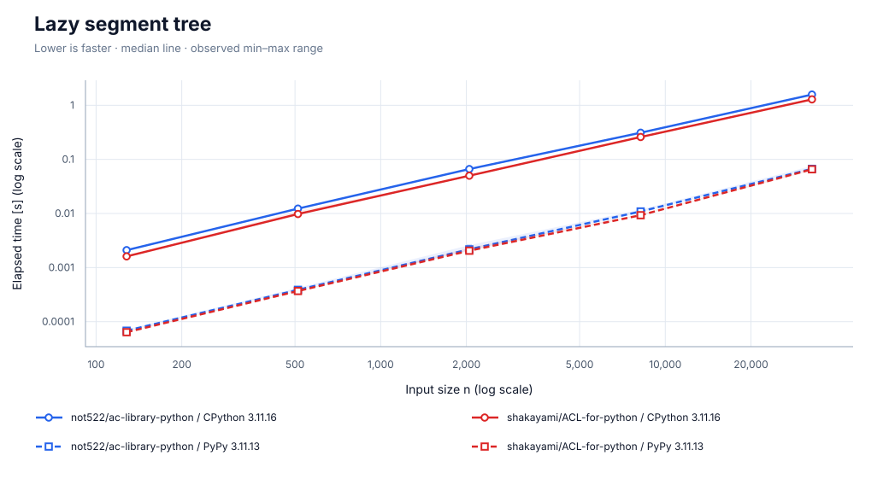

[SVG を保存](charts/lazysegtree.svg)

| ランタイム | 計測日時 | CPU | repeat / warmup / seed | JSON |
| --- | --- | --- | --- | --- |
| CPython 3.11.16 | 2026-09-26T03:55:18.510018+00:00 | INTEL\(R\) XEON\(R\) PLATINUM 8573C | 5 / 3 / 42 | [data](data/cpython/lazysegtree.json) |
| PyPy 3.11.13 | 2026-09-26T03:57:48.685267+00:00 | INTEL\(R\) XEON\(R\) PLATINUM 8573C | 5 / 3 / 42 | [data](data/pypy/lazysegtree.json) |

- CPython 3.11.16: commit `5455c55e646f368af0159b1b3c85572a0af2ade9`; OS: Linux-6.17.0-1022-azure-x86\_64-with-glibc2.39
  - n=\[128, 512, 2048, 8192, 32768\]; warmup_seconds=0.25; sample_seconds=0.025
  - build: 3.11.16 \(main, Aug 13 2026, 02:46:14\) \[GCC 13.3.0\]
  - not522: https://github.com/not522/ac-library-python.git @ `27fdbb71cd0d566bdeb12746db59c9d908c6b5d5`
  - shakayami: https://github.com/shakayami/ACL-for-python.git @ `880ed3fc236c9628d674363768bcf203fbb84a8d`
- PyPy 3.11.13: commit `5455c55e646f368af0159b1b3c85572a0af2ade9`; OS: Linux-6.17.0-1022-azure-x86\_64-with-glibc2.39
  - n=\[128, 512, 2048, 8192, 32768\]; warmup_seconds=0.25; sample_seconds=0.025
  - build: 3.11.13 \(413c9b7f57f5, Jul 03 2025, 18:03:56\) \[PyPy 7.3.20 with GCC 10.2.1 20210130 \(Red Hat 10.2.1-11\)\]
  - not522: https://github.com/not522/ac-library-python.git @ `27fdbb71cd0d566bdeb12746db59c9d908c6b5d5`
  - shakayami: https://github.com/shakayami/ACL-for-python.git @ `880ed3fc236c9628d674363768bcf203fbb84a8d`

## LCP array

長さ n の ASCII 文字列と計測外で生成した suffix array から LCP を計算。

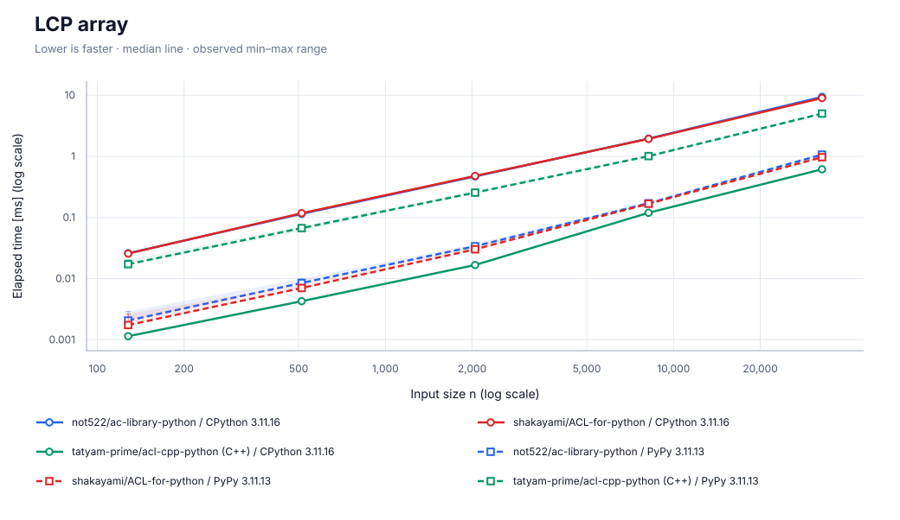

[SVG を保存](charts/lcp_array.svg)

| ランタイム | 計測日時 | CPU | repeat / warmup / seed | JSON |
| --- | --- | --- | --- | --- |
| CPython 3.11.16 | 2026-09-26T03:55:25.012744+00:00 | INTEL\(R\) XEON\(R\) PLATINUM 8573C | 5 / 3 / 42 | [data](data/cpython/lcp_array.json) |
| PyPy 3.11.13 | 2026-09-26T03:57:56.812970+00:00 | INTEL\(R\) XEON\(R\) PLATINUM 8573C | 5 / 3 / 42 | [data](data/pypy/lcp_array.json) |

- CPython 3.11.16: commit `5455c55e646f368af0159b1b3c85572a0af2ade9`; OS: Linux-6.17.0-1022-azure-x86\_64-with-glibc2.39
  - n=\[128, 512, 2048, 8192, 32768\]; warmup_seconds=0.25; sample_seconds=0.025
  - build: 3.11.16 \(main, Aug 13 2026, 02:46:14\) \[GCC 13.3.0\]
  - not522: https://github.com/not522/ac-library-python.git @ `27fdbb71cd0d566bdeb12746db59c9d908c6b5d5`
  - shakayami: https://github.com/shakayami/ACL-for-python.git @ `880ed3fc236c9628d674363768bcf203fbb84a8d`
  - tatyam: https://github.com/tatyam-prime/acl-cpp-python.git @ `b677fa437bdc1b0b7a4512d360de065cdca5778c`
- PyPy 3.11.13: commit `5455c55e646f368af0159b1b3c85572a0af2ade9`; OS: Linux-6.17.0-1022-azure-x86\_64-with-glibc2.39
  - n=\[128, 512, 2048, 8192, 32768\]; warmup_seconds=0.25; sample_seconds=0.025
  - build: 3.11.13 \(413c9b7f57f5, Jul 03 2025, 18:03:56\) \[PyPy 7.3.20 with GCC 10.2.1 20210130 \(Red Hat 10.2.1-11\)\]
  - not522: https://github.com/not522/ac-library-python.git @ `27fdbb71cd0d566bdeb12746db59c9d908c6b5d5`
  - shakayami: https://github.com/shakayami/ACL-for-python.git @ `880ed3fc236c9628d674363768bcf203fbb84a8d`
  - tatyam: https://github.com/tatyam-prime/acl-cpp-python.git @ `b677fa437bdc1b0b7a4512d360de065cdca5778c`

## Maximum flow

左右 n 頂点ずつの疎な二部グラフ。各左頂点から 4 辺。ネットワーク構築と最大流を計測。

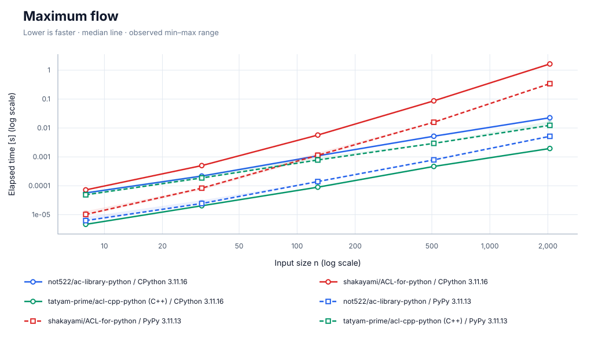

[SVG を保存](charts/maxflow.svg)

| ランタイム | 計測日時 | CPU | repeat / warmup / seed | JSON |
| --- | --- | --- | --- | --- |
| CPython 3.11.16 | 2026-09-26T03:55:48.128471+00:00 | INTEL\(R\) XEON\(R\) PLATINUM 8573C | 5 / 3 / 42 | [data](data/cpython/maxflow.json) |
| PyPy 3.11.13 | 2026-09-26T03:58:07.990949+00:00 | INTEL\(R\) XEON\(R\) PLATINUM 8573C | 5 / 3 / 42 | [data](data/pypy/maxflow.json) |

- CPython 3.11.16: commit `5455c55e646f368af0159b1b3c85572a0af2ade9`; OS: Linux-6.17.0-1022-azure-x86\_64-with-glibc2.39
  - n=\[8, 32, 128, 512, 2048\]; warmup_seconds=0.25; sample_seconds=0.025
  - build: 3.11.16 \(main, Aug 13 2026, 02:46:14\) \[GCC 13.3.0\]
  - not522: https://github.com/not522/ac-library-python.git @ `27fdbb71cd0d566bdeb12746db59c9d908c6b5d5`
  - shakayami: https://github.com/shakayami/ACL-for-python.git @ `880ed3fc236c9628d674363768bcf203fbb84a8d`
  - tatyam: https://github.com/tatyam-prime/acl-cpp-python.git @ `b677fa437bdc1b0b7a4512d360de065cdca5778c`
- PyPy 3.11.13: commit `5455c55e646f368af0159b1b3c85572a0af2ade9`; OS: Linux-6.17.0-1022-azure-x86\_64-with-glibc2.39
  - n=\[8, 32, 128, 512, 2048\]; warmup_seconds=0.25; sample_seconds=0.025
  - build: 3.11.13 \(413c9b7f57f5, Jul 03 2025, 18:03:56\) \[PyPy 7.3.20 with GCC 10.2.1 20210130 \(Red Hat 10.2.1-11\)\]
  - not522: https://github.com/not522/ac-library-python.git @ `27fdbb71cd0d566bdeb12746db59c9d908c6b5d5`
  - shakayami: https://github.com/shakayami/ACL-for-python.git @ `880ed3fc236c9628d674363768bcf203fbb84a8d`
  - tatyam: https://github.com/tatyam-prime/acl-cpp-python.git @ `b677fa437bdc1b0b7a4512d360de065cdca5778c`

## Minimum-cost flow

左右 n 頂点ずつの二部グラフ。各左頂点から 3 辺、非負コスト。構築と最小費用最大流を計測。

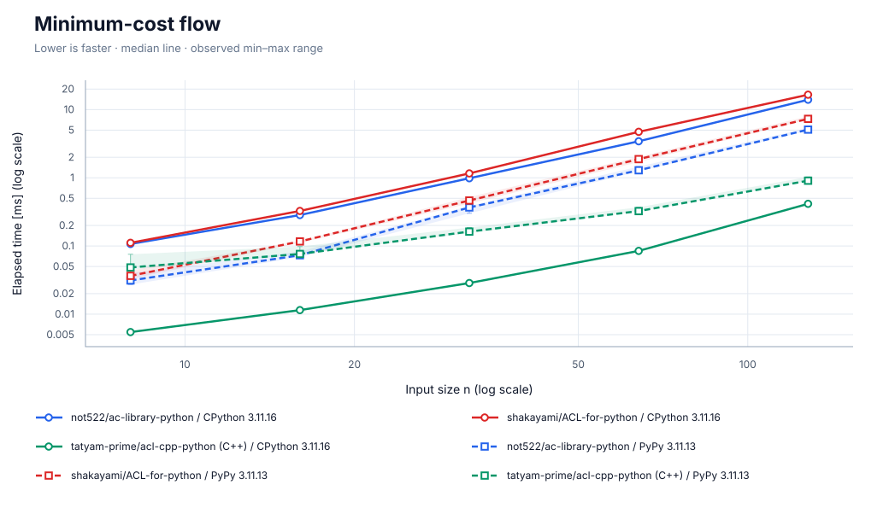

[SVG を保存](charts/mincostflow.svg)

| ランタイム | 計測日時 | CPU | repeat / warmup / seed | JSON |
| --- | --- | --- | --- | --- |
| CPython 3.11.16 | 2026-09-26T03:55:54.458751+00:00 | INTEL\(R\) XEON\(R\) PLATINUM 8573C | 5 / 3 / 42 | [data](data/cpython/mincostflow.json) |
| PyPy 3.11.13 | 2026-09-26T03:58:15.527436+00:00 | INTEL\(R\) XEON\(R\) PLATINUM 8573C | 5 / 3 / 42 | [data](data/pypy/mincostflow.json) |

- CPython 3.11.16: commit `5455c55e646f368af0159b1b3c85572a0af2ade9`; OS: Linux-6.17.0-1022-azure-x86\_64-with-glibc2.39
  - n=\[8, 16, 32, 64, 128\]; warmup_seconds=0.25; sample_seconds=0.025
  - build: 3.11.16 \(main, Aug 13 2026, 02:46:14\) \[GCC 13.3.0\]
  - not522: https://github.com/not522/ac-library-python.git @ `27fdbb71cd0d566bdeb12746db59c9d908c6b5d5`
  - shakayami: https://github.com/shakayami/ACL-for-python.git @ `880ed3fc236c9628d674363768bcf203fbb84a8d`
  - tatyam: https://github.com/tatyam-prime/acl-cpp-python.git @ `b677fa437bdc1b0b7a4512d360de065cdca5778c`
- PyPy 3.11.13: commit `5455c55e646f368af0159b1b3c85572a0af2ade9`; OS: Linux-6.17.0-1022-azure-x86\_64-with-glibc2.39
  - n=\[8, 16, 32, 64, 128\]; warmup_seconds=0.25; sample_seconds=0.025
  - build: 3.11.13 \(413c9b7f57f5, Jul 03 2025, 18:03:56\) \[PyPy 7.3.20 with GCC 10.2.1 20210130 \(Red Hat 10.2.1-11\)\]
  - not522: https://github.com/not522/ac-library-python.git @ `27fdbb71cd0d566bdeb12746db59c9d908c6b5d5`
  - shakayami: https://github.com/shakayami/ACL-for-python.git @ `880ed3fc236c9628d674363768bcf203fbb84a8d`
  - tatyam: https://github.com/tatyam-prime/acl-cpp-python.git @ `b677fa437bdc1b0b7a4512d360de065cdca5778c`

## Strongly connected components

n 頂点・4n 辺。小さいブロック内の辺と前方への辺を混在。グラフ構築と結果の正規化も計測。

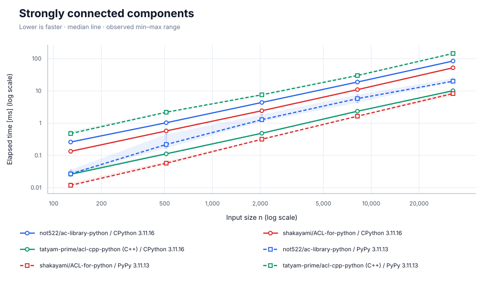

[SVG を保存](charts/scc.svg)

| ランタイム | 計測日時 | CPU | repeat / warmup / seed | JSON |
| --- | --- | --- | --- | --- |
| CPython 3.11.16 | 2026-09-26T03:56:02.393165+00:00 | INTEL\(R\) XEON\(R\) PLATINUM 8573C | 5 / 3 / 42 | [data](data/cpython/scc.json) |
| PyPy 3.11.13 | 2026-09-26T03:58:26.979722+00:00 | INTEL\(R\) XEON\(R\) PLATINUM 8573C | 5 / 3 / 42 | [data](data/pypy/scc.json) |

- CPython 3.11.16: commit `5455c55e646f368af0159b1b3c85572a0af2ade9`; OS: Linux-6.17.0-1022-azure-x86\_64-with-glibc2.39
  - n=\[128, 512, 2048, 8192, 32768\]; warmup_seconds=0.25; sample_seconds=0.025
  - build: 3.11.16 \(main, Aug 13 2026, 02:46:14\) \[GCC 13.3.0\]
  - not522: https://github.com/not522/ac-library-python.git @ `27fdbb71cd0d566bdeb12746db59c9d908c6b5d5`
  - shakayami: https://github.com/shakayami/ACL-for-python.git @ `880ed3fc236c9628d674363768bcf203fbb84a8d`
  - tatyam: https://github.com/tatyam-prime/acl-cpp-python.git @ `b677fa437bdc1b0b7a4512d360de065cdca5778c`
- PyPy 3.11.13: commit `5455c55e646f368af0159b1b3c85572a0af2ade9`; OS: Linux-6.17.0-1022-azure-x86\_64-with-glibc2.39
  - n=\[128, 512, 2048, 8192, 32768\]; warmup_seconds=0.25; sample_seconds=0.025
  - build: 3.11.13 \(413c9b7f57f5, Jul 03 2025, 18:03:56\) \[PyPy 7.3.20 with GCC 10.2.1 20210130 \(Red Hat 10.2.1-11\)\]
  - not522: https://github.com/not522/ac-library-python.git @ `27fdbb71cd0d566bdeb12746db59c9d908c6b5d5`
  - shakayami: https://github.com/shakayami/ACL-for-python.git @ `880ed3fc236c9628d674363768bcf203fbb84a8d`
  - tatyam: https://github.com/tatyam-prime/acl-cpp-python.git @ `b677fa437bdc1b0b7a4512d360de065cdca5778c`

## Segment tree

n 要素・4n 回の一点更新 / 区間和。構築も計測。C++ 版には公開 API がないため Python 2 実装を比較。

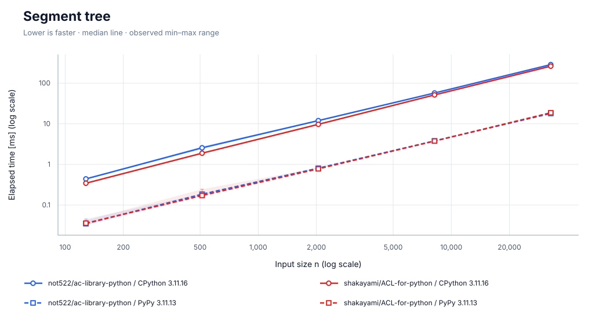

[SVG を保存](charts/segtree.svg)

| ランタイム | 計測日時 | CPU | repeat / warmup / seed | JSON |
| --- | --- | --- | --- | --- |
| CPython 3.11.16 | 2026-09-26T03:56:12.540001+00:00 | INTEL\(R\) XEON\(R\) PLATINUM 8573C | 5 / 3 / 42 | [data](data/cpython/segtree.json) |
| PyPy 3.11.13 | 2026-09-26T03:58:33.547902+00:00 | INTEL\(R\) XEON\(R\) PLATINUM 8573C | 5 / 3 / 42 | [data](data/pypy/segtree.json) |

- CPython 3.11.16: commit `5455c55e646f368af0159b1b3c85572a0af2ade9`; OS: Linux-6.17.0-1022-azure-x86\_64-with-glibc2.39
  - n=\[128, 512, 2048, 8192, 32768\]; warmup_seconds=0.25; sample_seconds=0.025
  - build: 3.11.16 \(main, Aug 13 2026, 02:46:14\) \[GCC 13.3.0\]
  - not522: https://github.com/not522/ac-library-python.git @ `27fdbb71cd0d566bdeb12746db59c9d908c6b5d5`
  - shakayami: https://github.com/shakayami/ACL-for-python.git @ `880ed3fc236c9628d674363768bcf203fbb84a8d`
- PyPy 3.11.13: commit `5455c55e646f368af0159b1b3c85572a0af2ade9`; OS: Linux-6.17.0-1022-azure-x86\_64-with-glibc2.39
  - n=\[128, 512, 2048, 8192, 32768\]; warmup_seconds=0.25; sample_seconds=0.025
  - build: 3.11.13 \(413c9b7f57f5, Jul 03 2025, 18:03:56\) \[PyPy 7.3.20 with GCC 10.2.1 20210130 \(Red Hat 10.2.1-11\)\]
  - not522: https://github.com/not522/ac-library-python.git @ `27fdbb71cd0d566bdeb12746db59c9d908c6b5d5`
  - shakayami: https://github.com/shakayami/ACL-for-python.git @ `880ed3fc236c9628d674363768bcf203fbb84a8d`

## Suffix array

長さ n の ASCII 文字列の suffix array。Python/C++ 間の変換も含む。

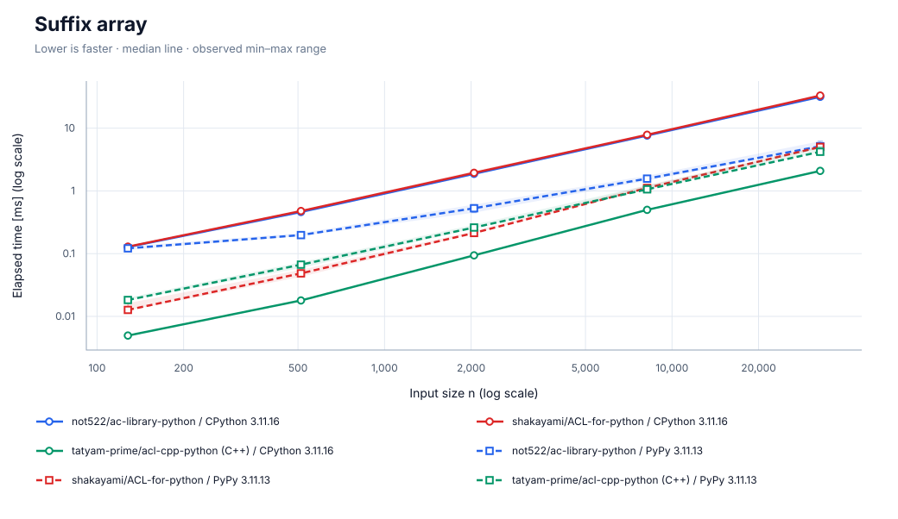

[SVG を保存](charts/suffix_array.svg)

| ランタイム | 計測日時 | CPU | repeat / warmup / seed | JSON |
| --- | --- | --- | --- | --- |
| CPython 3.11.16 | 2026-09-26T03:56:19.150637+00:00 | INTEL\(R\) XEON\(R\) PLATINUM 8573C | 5 / 3 / 42 | [data](data/cpython/suffix_array.json) |
| PyPy 3.11.13 | 2026-09-26T03:58:41.365163+00:00 | INTEL\(R\) XEON\(R\) PLATINUM 8573C | 5 / 3 / 42 | [data](data/pypy/suffix_array.json) |

- CPython 3.11.16: commit `5455c55e646f368af0159b1b3c85572a0af2ade9`; OS: Linux-6.17.0-1022-azure-x86\_64-with-glibc2.39
  - n=\[128, 512, 2048, 8192, 32768\]; warmup_seconds=0.25; sample_seconds=0.025
  - build: 3.11.16 \(main, Aug 13 2026, 02:46:14\) \[GCC 13.3.0\]
  - not522: https://github.com/not522/ac-library-python.git @ `27fdbb71cd0d566bdeb12746db59c9d908c6b5d5`
  - shakayami: https://github.com/shakayami/ACL-for-python.git @ `880ed3fc236c9628d674363768bcf203fbb84a8d`
  - tatyam: https://github.com/tatyam-prime/acl-cpp-python.git @ `b677fa437bdc1b0b7a4512d360de065cdca5778c`
- PyPy 3.11.13: commit `5455c55e646f368af0159b1b3c85572a0af2ade9`; OS: Linux-6.17.0-1022-azure-x86\_64-with-glibc2.39
  - n=\[128, 512, 2048, 8192, 32768\]; warmup_seconds=0.25; sample_seconds=0.025
  - build: 3.11.13 \(413c9b7f57f5, Jul 03 2025, 18:03:56\) \[PyPy 7.3.20 with GCC 10.2.1 20210130 \(Red Hat 10.2.1-11\)\]
  - not522: https://github.com/not522/ac-library-python.git @ `27fdbb71cd0d566bdeb12746db59c9d908c6b5d5`
  - shakayami: https://github.com/shakayami/ACL-for-python.git @ `880ed3fc236c9628d674363768bcf203fbb84a8d`
  - tatyam: https://github.com/tatyam-prime/acl-cpp-python.git @ `b677fa437bdc1b0b7a4512d360de065cdca5778c`

## 2-SAT

n 変数・4n 節。充足可能なランダム式の構築と求解。返り値は充足可能性と解の整合性。

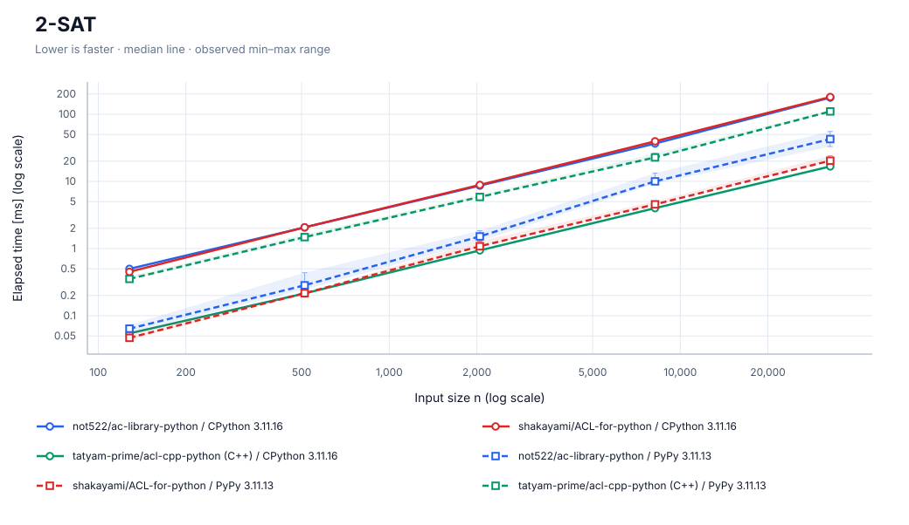

[SVG を保存](charts/two_sat.svg)

| ランタイム | 計測日時 | CPU | repeat / warmup / seed | JSON |
| --- | --- | --- | --- | --- |
| CPython 3.11.16 | 2026-09-26T03:56:29.601802+00:00 | INTEL\(R\) XEON\(R\) PLATINUM 8573C | 5 / 3 / 42 | [data](data/cpython/two_sat.json) |
| PyPy 3.11.13 | 2026-09-26T03:58:54.193692+00:00 | INTEL\(R\) XEON\(R\) PLATINUM 8573C | 5 / 3 / 42 | [data](data/pypy/two_sat.json) |

- CPython 3.11.16: commit `5455c55e646f368af0159b1b3c85572a0af2ade9`; OS: Linux-6.17.0-1022-azure-x86\_64-with-glibc2.39
  - n=\[128, 512, 2048, 8192, 32768\]; warmup_seconds=0.25; sample_seconds=0.025
  - build: 3.11.16 \(main, Aug 13 2026, 02:46:14\) \[GCC 13.3.0\]
  - not522: https://github.com/not522/ac-library-python.git @ `27fdbb71cd0d566bdeb12746db59c9d908c6b5d5`
  - shakayami: https://github.com/shakayami/ACL-for-python.git @ `880ed3fc236c9628d674363768bcf203fbb84a8d`
  - tatyam: https://github.com/tatyam-prime/acl-cpp-python.git @ `b677fa437bdc1b0b7a4512d360de065cdca5778c`
- PyPy 3.11.13: commit `5455c55e646f368af0159b1b3c85572a0af2ade9`; OS: Linux-6.17.0-1022-azure-x86\_64-with-glibc2.39
  - n=\[128, 512, 2048, 8192, 32768\]; warmup_seconds=0.25; sample_seconds=0.025
  - build: 3.11.13 \(413c9b7f57f5, Jul 03 2025, 18:03:56\) \[PyPy 7.3.20 with GCC 10.2.1 20210130 \(Red Hat 10.2.1-11\)\]
  - not522: https://github.com/not522/ac-library-python.git @ `27fdbb71cd0d566bdeb12746db59c9d908c6b5d5`
  - shakayami: https://github.com/shakayami/ACL-for-python.git @ `880ed3fc236c9628d674363768bcf203fbb84a8d`
  - tatyam: https://github.com/tatyam-prime/acl-cpp-python.git @ `b677fa437bdc1b0b7a4512d360de065cdca5778c`

## Z algorithm

長さ n の ASCII 文字列の Z 配列。Python/C++ 間の変換も含む。

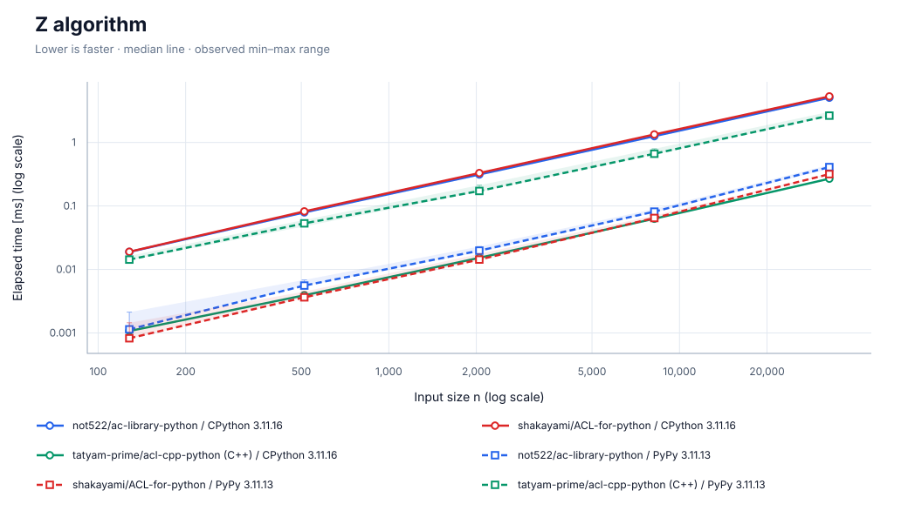

[SVG を保存](charts/z_algorithm.svg)

| ランタイム | 計測日時 | CPU | repeat / warmup / seed | JSON |
| --- | --- | --- | --- | --- |
| CPython 3.11.16 | 2026-09-26T03:56:35.807896+00:00 | INTEL\(R\) XEON\(R\) PLATINUM 8573C | 5 / 3 / 42 | [data](data/cpython/z_algorithm.json) |
| PyPy 3.11.13 | 2026-09-26T03:59:01.873623+00:00 | INTEL\(R\) XEON\(R\) PLATINUM 8573C | 5 / 3 / 42 | [data](data/pypy/z_algorithm.json) |

- CPython 3.11.16: commit `5455c55e646f368af0159b1b3c85572a0af2ade9`; OS: Linux-6.17.0-1022-azure-x86\_64-with-glibc2.39
  - n=\[128, 512, 2048, 8192, 32768\]; warmup_seconds=0.25; sample_seconds=0.025
  - build: 3.11.16 \(main, Aug 13 2026, 02:46:14\) \[GCC 13.3.0\]
  - not522: https://github.com/not522/ac-library-python.git @ `27fdbb71cd0d566bdeb12746db59c9d908c6b5d5`
  - shakayami: https://github.com/shakayami/ACL-for-python.git @ `880ed3fc236c9628d674363768bcf203fbb84a8d`
  - tatyam: https://github.com/tatyam-prime/acl-cpp-python.git @ `b677fa437bdc1b0b7a4512d360de065cdca5778c`
- PyPy 3.11.13: commit `5455c55e646f368af0159b1b3c85572a0af2ade9`; OS: Linux-6.17.0-1022-azure-x86\_64-with-glibc2.39
  - n=\[128, 512, 2048, 8192, 32768\]; warmup_seconds=0.25; sample_seconds=0.025
  - build: 3.11.13 \(413c9b7f57f5, Jul 03 2025, 18:03:56\) \[PyPy 7.3.20 with GCC 10.2.1 20210130 \(Red Hat 10.2.1-11\)\]
  - not522: https://github.com/not522/ac-library-python.git @ `27fdbb71cd0d566bdeb12746db59c9d908c6b5d5`
  - shakayami: https://github.com/shakayami/ACL-for-python.git @ `880ed3fc236c9628d674363768bcf203fbb84a8d`
  - tatyam: https://github.com/tatyam-prime/acl-cpp-python.git @ `b677fa437bdc1b0b7a4512d360de065cdca5778c`

CI の CPU・負荷・ランタイムのバージョンによって実行時間は変動します。増分計測ではケースやランタイムごとに計測日時が異なります。各グラフの計測情報と JSON を併せて確認してください。
