# Python ACL ベンチマーク

各実装を CPython / PyPy で比較します。グラフはランタイムごとに分け、軸の範囲を個別に調整します。グラフは小さいほど高速です。線は中央値、帯・ひげは観測された最小値から最大値です。正の値には対数軸を使い、0 を含む軸には線形軸を使います。

[HTML レポート](index.html) · [生データ](data/)

## Convolution \(mod 998244353\)

長さ n の 2 配列の畳み込み。FFT インスタンスの初期化・Python/C++ 間の変換も含む。

### CPython 3.11.16

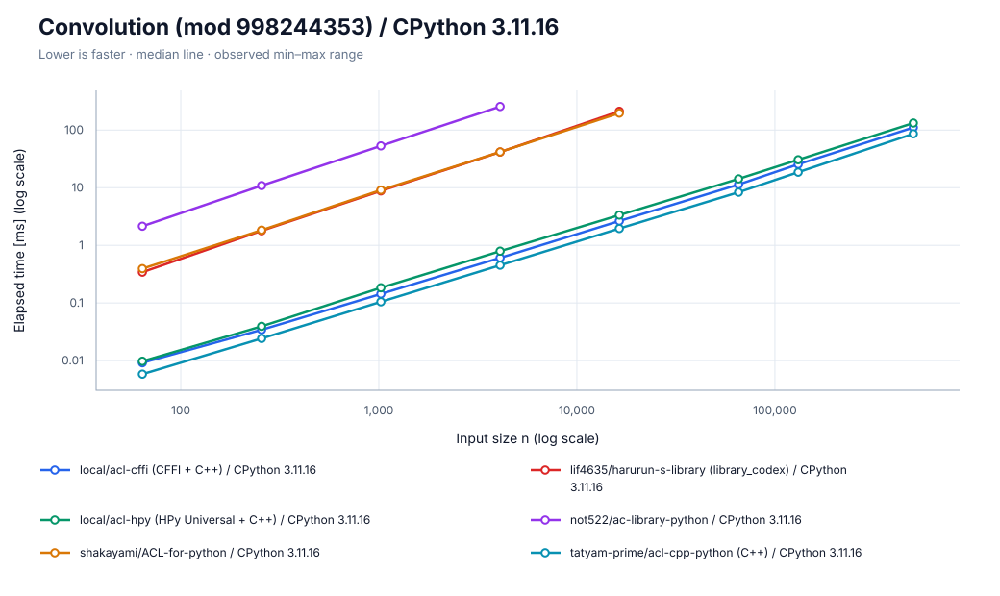

[SVG を保存](charts/convolution/cpython.svg)

タイムアウト（グラフから除外）: harurun n=65536, harurun n=131072, harurun n=500000, not522 n=16384, not522 n=65536, not522 n=131072, not522 n=500000, shakayami n=65536, shakayami n=131072, shakayami n=500000

### PyPy 3.11.13

[SVG を保存](charts/convolution/pypy.svg)

タイムアウト（グラフから除外）: hpy\_universal n=500000, not522 n=65536, not522 n=131072, not522 n=500000, tatyam n=500000

**参考用：C++単体の実行時間（Pythonとの値変換・プロセス起動・入出力を除外）。**

- C++ ACL（参考用）: 2026-09-27T22:05:31.619687+00:00; g++ \(Ubuntu 13.3.0-6ubuntu2~24.04.1\) 13.3.0 \| -std=c++17 -O3 -DNDEBUG -march=native; timeout n=\[\]

### 計測情報

| ランタイム | 計測日時 | CPU | repeat / warmup / seed | JSON |
| --- | --- | --- | --- | --- |
| CPython 3.11.16 | 2026-09-27T21:43:25.597615+00:00 | AMD EPYC 7763 64-Core Processor | 5 / 3 / 42 | [data](data/cpython/convolution.json) |
| PyPy 3.11.13 | 2026-09-27T21:54:59.084553+00:00 | AMD EPYC 7763 64-Core Processor | 5 / 3 / 42 | [data](data/pypy/convolution.json) |

- CPython 3.11.16: commit `ba4c9fde1991ed96f526d42396ff2a003d0a7a73`; OS: Linux-6.17.0-1022-azure-x86\_64-with-glibc2.39
  - n=\[64, 256, 1024, 4096, 16384, 65536, 131072, 500000\]; warmup_seconds=0.25; sample_seconds=0.025
  - build: 3.11.16 \(main, Aug 13 2026, 02:46:14\) \[GCC 13.3.0\]
  - cffi: https://github.com/atcoder/ac-library.git @ `864245a00b00dd008d1abfdc239618fdb7d139da`
  - harurun: https://github.com/lif4635/harurun-s-library.git @ `7c94b7bb0c9d4f6ed0ffa44853febee1e7971ff9`
  - hpy: https://github.com/atcoder/ac-library.git @ `864245a00b00dd008d1abfdc239618fdb7d139da`
  - not522: https://github.com/not522/ac-library-python.git @ `27fdbb71cd0d566bdeb12746db59c9d908c6b5d5`
  - shakayami: https://github.com/shakayami/ACL-for-python.git @ `880ed3fc236c9628d674363768bcf203fbb84a8d`
  - tatyam: https://github.com/tatyam-prime/acl-cpp-python.git @ `b677fa437bdc1b0b7a4512d360de065cdca5778c`
- PyPy 3.11.13: commit `ba4c9fde1991ed96f526d42396ff2a003d0a7a73`; OS: Linux-6.17.0-1022-azure-x86\_64-with-glibc2.39
  - n=\[64, 256, 1024, 4096, 16384, 65536, 131072, 500000\]; warmup_seconds=0.25; sample_seconds=0.025
  - build: 3.11.13 \(413c9b7f57f5, Jul 03 2025, 18:03:56\) \[PyPy 7.3.20 with GCC 10.2.1 20210130 \(Red Hat 10.2.1-11\)\]
  - cffi: https://github.com/atcoder/ac-library.git @ `864245a00b00dd008d1abfdc239618fdb7d139da`
  - harurun: https://github.com/lif4635/harurun-s-library.git @ `7c94b7bb0c9d4f6ed0ffa44853febee1e7971ff9`
  - hpy: https://github.com/atcoder/ac-library.git @ `864245a00b00dd008d1abfdc239618fdb7d139da`
  - not522: https://github.com/not522/ac-library-python.git @ `27fdbb71cd0d566bdeb12746db59c9d908c6b5d5`
  - shakayami: https://github.com/shakayami/ACL-for-python.git @ `880ed3fc236c9628d674363768bcf203fbb84a8d`
  - tatyam: https://github.com/tatyam-prime/acl-cpp-python.git @ `b677fa437bdc1b0b7a4512d360de065cdca5778c`

## Chinese remainder theorem

n 組の合同式を処理。各組は 4 個の法、最小公倍数を 64 bit 以内に固定。

### CPython 3.11.16

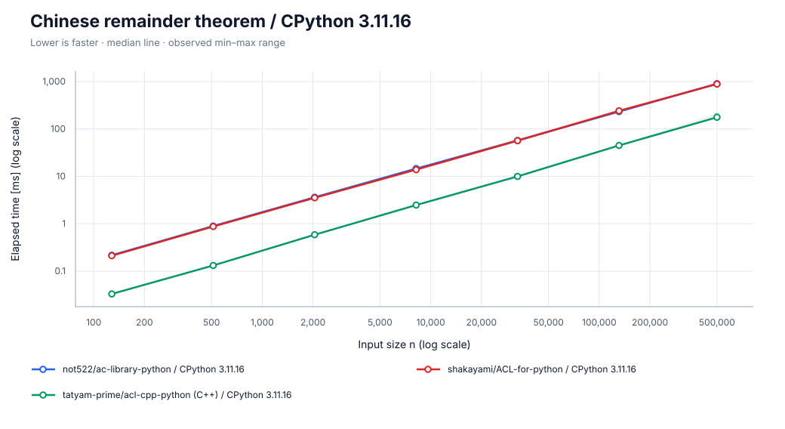

[SVG を保存](charts/crt/cpython.svg)

タイムアウト（グラフから除外）: cffi n=500000, harurun n=131072, harurun n=500000, hpy\_universal n=500000, not522 n=500000, shakayami n=500000, tatyam n=500000

### PyPy 3.11.13

[SVG を保存](charts/crt/pypy.svg)

タイムアウト（グラフから除外）: cffi n=500000, harurun n=500000, hpy\_universal n=131072, hpy\_universal n=500000, not522 n=500000, shakayami n=500000, tatyam n=131072, tatyam n=500000

**参考用：C++単体の実行時間（Pythonとの値変換・プロセス起動・入出力を除外）。**

- C++ ACL（参考用）: 2026-09-27T22:05:38.493554+00:00; g++ \(Ubuntu 13.3.0-6ubuntu2~24.04.1\) 13.3.0 \| -std=c++17 -O3 -DNDEBUG -march=native; timeout n=\[\]

### 計測情報

| ランタイム | 計測日時 | CPU | repeat / warmup / seed | JSON |
| --- | --- | --- | --- | --- |
| CPython 3.11.16 | 2026-09-27T21:44:27.174043+00:00 | AMD EPYC 7763 64-Core Processor | 5 / 3 / 42 | [data](data/cpython/crt.json) |
| PyPy 3.11.13 | 2026-09-27T21:56:07.077714+00:00 | AMD EPYC 7763 64-Core Processor | 5 / 3 / 42 | [data](data/pypy/crt.json) |

- CPython 3.11.16: commit `ba4c9fde1991ed96f526d42396ff2a003d0a7a73`; OS: Linux-6.17.0-1022-azure-x86\_64-with-glibc2.39
  - n=\[128, 512, 2048, 8192, 32768, 131072, 500000\]; warmup_seconds=0.25; sample_seconds=0.025
  - build: 3.11.16 \(main, Aug 13 2026, 02:46:14\) \[GCC 13.3.0\]
  - cffi: https://github.com/atcoder/ac-library.git @ `864245a00b00dd008d1abfdc239618fdb7d139da`
  - harurun: https://github.com/lif4635/harurun-s-library.git @ `7c94b7bb0c9d4f6ed0ffa44853febee1e7971ff9`
  - hpy: https://github.com/atcoder/ac-library.git @ `864245a00b00dd008d1abfdc239618fdb7d139da`
  - not522: https://github.com/not522/ac-library-python.git @ `27fdbb71cd0d566bdeb12746db59c9d908c6b5d5`
  - shakayami: https://github.com/shakayami/ACL-for-python.git @ `880ed3fc236c9628d674363768bcf203fbb84a8d`
  - tatyam: https://github.com/tatyam-prime/acl-cpp-python.git @ `b677fa437bdc1b0b7a4512d360de065cdca5778c`
- PyPy 3.11.13: commit `ba4c9fde1991ed96f526d42396ff2a003d0a7a73`; OS: Linux-6.17.0-1022-azure-x86\_64-with-glibc2.39
  - n=\[128, 512, 2048, 8192, 32768, 131072, 500000\]; warmup_seconds=0.25; sample_seconds=0.025
  - build: 3.11.13 \(413c9b7f57f5, Jul 03 2025, 18:03:56\) \[PyPy 7.3.20 with GCC 10.2.1 20210130 \(Red Hat 10.2.1-11\)\]
  - cffi: https://github.com/atcoder/ac-library.git @ `864245a00b00dd008d1abfdc239618fdb7d139da`
  - harurun: https://github.com/lif4635/harurun-s-library.git @ `7c94b7bb0c9d4f6ed0ffa44853febee1e7971ff9`
  - hpy: https://github.com/atcoder/ac-library.git @ `864245a00b00dd008d1abfdc239618fdb7d139da`
  - not522: https://github.com/not522/ac-library-python.git @ `27fdbb71cd0d566bdeb12746db59c9d908c6b5d5`
  - shakayami: https://github.com/shakayami/ACL-for-python.git @ `880ed3fc236c9628d674363768bcf203fbb84a8d`
  - tatyam: https://github.com/tatyam-prime/acl-cpp-python.git @ `b677fa437bdc1b0b7a4512d360de065cdca5778c`

## DSU / Union-Find

n 頂点・4n 回の merge / same。初期化と全クエリを計測。

### CPython 3.11.16

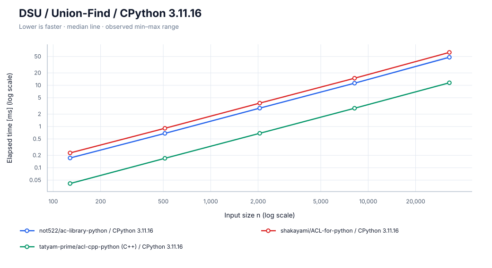

[SVG を保存](charts/dsu/cpython.svg)

タイムアウト（グラフから除外）: cffi n=500000, harurun n=500000, hpy\_universal n=500000, not522 n=500000, shakayami n=500000, tatyam n=500000

### PyPy 3.11.13

[SVG を保存](charts/dsu/pypy.svg)

タイムアウト（グラフから除外）: cffi n=500000, harurun n=500000, hpy\_universal n=500000, not522 n=500000, shakayami n=500000, tatyam n=131072, tatyam n=500000

**参考用：C++単体の実行時間（Pythonとの値変換・プロセス起動・入出力を除外）。**

- C++ ACL（参考用）: 2026-09-27T22:05:44.552717+00:00; g++ \(Ubuntu 13.3.0-6ubuntu2~24.04.1\) 13.3.0 \| -std=c++17 -O3 -DNDEBUG -march=native; timeout n=\[\]

### 計測情報

| ランタイム | 計測日時 | CPU | repeat / warmup / seed | JSON |
| --- | --- | --- | --- | --- |
| CPython 3.11.16 | 2026-09-27T21:45:24.061339+00:00 | AMD EPYC 7763 64-Core Processor | 5 / 3 / 42 | [data](data/cpython/dsu.json) |
| PyPy 3.11.13 | 2026-09-27T21:57:13.100866+00:00 | AMD EPYC 7763 64-Core Processor | 5 / 3 / 42 | [data](data/pypy/dsu.json) |

- CPython 3.11.16: commit `ba4c9fde1991ed96f526d42396ff2a003d0a7a73`; OS: Linux-6.17.0-1022-azure-x86\_64-with-glibc2.39
  - n=\[128, 512, 2048, 8192, 32768, 131072, 500000\]; warmup_seconds=0.25; sample_seconds=0.025
  - build: 3.11.16 \(main, Aug 13 2026, 02:46:14\) \[GCC 13.3.0\]
  - cffi: https://github.com/atcoder/ac-library.git @ `864245a00b00dd008d1abfdc239618fdb7d139da`
  - harurun: https://github.com/lif4635/harurun-s-library.git @ `7c94b7bb0c9d4f6ed0ffa44853febee1e7971ff9`
  - hpy: https://github.com/atcoder/ac-library.git @ `864245a00b00dd008d1abfdc239618fdb7d139da`
  - not522: https://github.com/not522/ac-library-python.git @ `27fdbb71cd0d566bdeb12746db59c9d908c6b5d5`
  - shakayami: https://github.com/shakayami/ACL-for-python.git @ `880ed3fc236c9628d674363768bcf203fbb84a8d`
  - tatyam: https://github.com/tatyam-prime/acl-cpp-python.git @ `b677fa437bdc1b0b7a4512d360de065cdca5778c`
- PyPy 3.11.13: commit `ba4c9fde1991ed96f526d42396ff2a003d0a7a73`; OS: Linux-6.17.0-1022-azure-x86\_64-with-glibc2.39
  - n=\[128, 512, 2048, 8192, 32768, 131072, 500000\]; warmup_seconds=0.25; sample_seconds=0.025
  - build: 3.11.13 \(413c9b7f57f5, Jul 03 2025, 18:03:56\) \[PyPy 7.3.20 with GCC 10.2.1 20210130 \(Red Hat 10.2.1-11\)\]
  - cffi: https://github.com/atcoder/ac-library.git @ `864245a00b00dd008d1abfdc239618fdb7d139da`
  - harurun: https://github.com/lif4635/harurun-s-library.git @ `7c94b7bb0c9d4f6ed0ffa44853febee1e7971ff9`
  - hpy: https://github.com/atcoder/ac-library.git @ `864245a00b00dd008d1abfdc239618fdb7d139da`
  - not522: https://github.com/not522/ac-library-python.git @ `27fdbb71cd0d566bdeb12746db59c9d908c6b5d5`
  - shakayami: https://github.com/shakayami/ACL-for-python.git @ `880ed3fc236c9628d674363768bcf203fbb84a8d`
  - tatyam: https://github.com/tatyam-prime/acl-cpp-python.git @ `b677fa437bdc1b0b7a4512d360de065cdca5778c`

## Fenwick tree

n 要素・4n 回の一点加算 / 区間和。ゼロ初期化と全クエリを計測。

### CPython 3.11.16

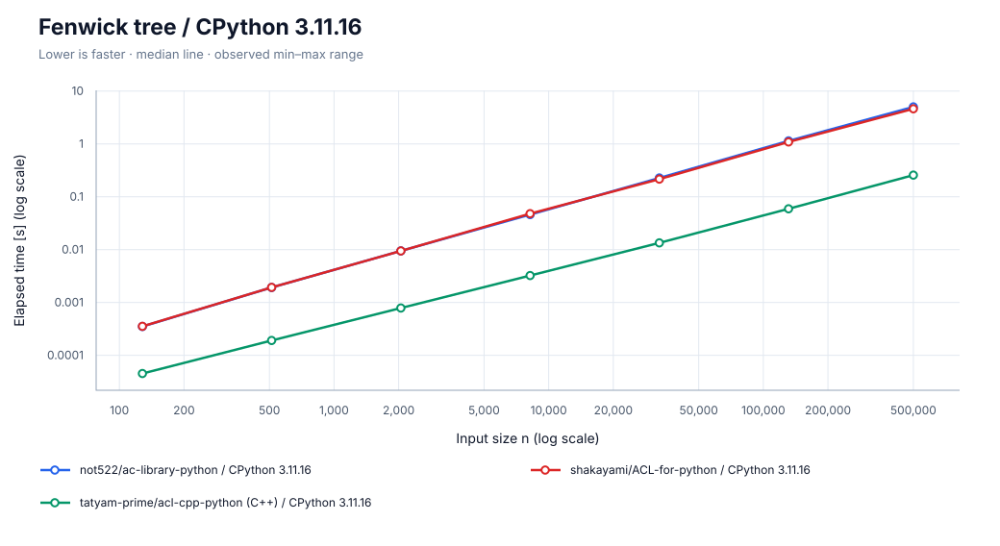

[SVG を保存](charts/fenwicktree/cpython.svg)

タイムアウト（グラフから除外）: cffi n=500000, harurun n=131072, harurun n=500000, hpy\_universal n=500000, not522 n=131072, not522 n=500000, shakayami n=131072, shakayami n=500000, tatyam n=500000

### PyPy 3.11.13

[SVG を保存](charts/fenwicktree/pypy.svg)

タイムアウト（グラフから除外）: cffi n=500000, harurun n=500000, hpy\_universal n=500000, not522 n=500000, shakayami n=500000, tatyam n=131072, tatyam n=500000

**参考用：C++単体の実行時間（Pythonとの値変換・プロセス起動・入出力を除外）。**

- C++ ACL（参考用）: 2026-09-27T22:05:51.279939+00:00; g++ \(Ubuntu 13.3.0-6ubuntu2~24.04.1\) 13.3.0 \| -std=c++17 -O3 -DNDEBUG -march=native; timeout n=\[\]

### 計測情報

| ランタイム | 計測日時 | CPU | repeat / warmup / seed | JSON |
| --- | --- | --- | --- | --- |
| CPython 3.11.16 | 2026-09-27T21:46:30.115842+00:00 | AMD EPYC 7763 64-Core Processor | 5 / 3 / 42 | [data](data/cpython/fenwicktree.json) |
| PyPy 3.11.13 | 2026-09-27T21:58:18.932085+00:00 | AMD EPYC 7763 64-Core Processor | 5 / 3 / 42 | [data](data/pypy/fenwicktree.json) |

- CPython 3.11.16: commit `ba4c9fde1991ed96f526d42396ff2a003d0a7a73`; OS: Linux-6.17.0-1022-azure-x86\_64-with-glibc2.39
  - n=\[128, 512, 2048, 8192, 32768, 131072, 500000\]; warmup_seconds=0.25; sample_seconds=0.025
  - build: 3.11.16 \(main, Aug 13 2026, 02:46:14\) \[GCC 13.3.0\]
  - cffi: https://github.com/atcoder/ac-library.git @ `864245a00b00dd008d1abfdc239618fdb7d139da`
  - harurun: https://github.com/lif4635/harurun-s-library.git @ `7c94b7bb0c9d4f6ed0ffa44853febee1e7971ff9`
  - hpy: https://github.com/atcoder/ac-library.git @ `864245a00b00dd008d1abfdc239618fdb7d139da`
  - not522: https://github.com/not522/ac-library-python.git @ `27fdbb71cd0d566bdeb12746db59c9d908c6b5d5`
  - shakayami: https://github.com/shakayami/ACL-for-python.git @ `880ed3fc236c9628d674363768bcf203fbb84a8d`
  - tatyam: https://github.com/tatyam-prime/acl-cpp-python.git @ `b677fa437bdc1b0b7a4512d360de065cdca5778c`
- PyPy 3.11.13: commit `ba4c9fde1991ed96f526d42396ff2a003d0a7a73`; OS: Linux-6.17.0-1022-azure-x86\_64-with-glibc2.39
  - n=\[128, 512, 2048, 8192, 32768, 131072, 500000\]; warmup_seconds=0.25; sample_seconds=0.025
  - build: 3.11.13 \(413c9b7f57f5, Jul 03 2025, 18:03:56\) \[PyPy 7.3.20 with GCC 10.2.1 20210130 \(Red Hat 10.2.1-11\)\]
  - cffi: https://github.com/atcoder/ac-library.git @ `864245a00b00dd008d1abfdc239618fdb7d139da`
  - harurun: https://github.com/lif4635/harurun-s-library.git @ `7c94b7bb0c9d4f6ed0ffa44853febee1e7971ff9`
  - hpy: https://github.com/atcoder/ac-library.git @ `864245a00b00dd008d1abfdc239618fdb7d139da`
  - not522: https://github.com/not522/ac-library-python.git @ `27fdbb71cd0d566bdeb12746db59c9d908c6b5d5`
  - shakayami: https://github.com/shakayami/ACL-for-python.git @ `880ed3fc236c9628d674363768bcf203fbb84a8d`
  - tatyam: https://github.com/tatyam-prime/acl-cpp-python.git @ `b677fa437bdc1b0b7a4512d360de065cdca5778c`

## Floor sum

n 回の floor\_sum 呼び出し。引数 n,m は 1..999999、a,b は 0..999999。結果は符号付き 64 bit 以内。

### CPython 3.11.16

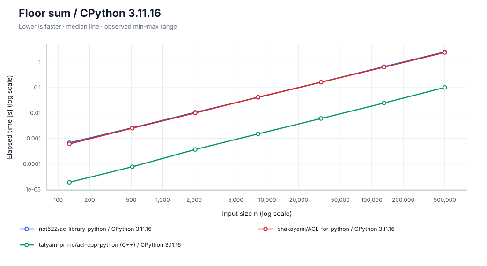

[SVG を保存](charts/floor_sum/cpython.svg)

タイムアウト（グラフから除外）: cffi n=500000, harurun n=131072, harurun n=500000, not522 n=131072, not522 n=500000, shakayami n=131072, shakayami n=500000

### PyPy 3.11.13

[SVG を保存](charts/floor_sum/pypy.svg)

タイムアウト（グラフから除外）: hpy\_universal n=500000, not522 n=500000, tatyam n=500000

**参考用：C++単体の実行時間（Pythonとの値変換・プロセス起動・入出力を除外）。**

- C++ ACL（参考用）: 2026-09-27T22:05:55.521940+00:00; g++ \(Ubuntu 13.3.0-6ubuntu2~24.04.1\) 13.3.0 \| -std=c++17 -O3 -DNDEBUG -march=native; timeout n=\[\]

### 計測情報

| ランタイム | 計測日時 | CPU | repeat / warmup / seed | JSON |
| --- | --- | --- | --- | --- |
| CPython 3.11.16 | 2026-09-27T21:47:26.673967+00:00 | AMD EPYC 7763 64-Core Processor | 5 / 3 / 42 | [data](data/cpython/floor_sum.json) |
| PyPy 3.11.13 | 2026-09-27T21:59:11.498337+00:00 | AMD EPYC 7763 64-Core Processor | 5 / 3 / 42 | [data](data/pypy/floor_sum.json) |

- CPython 3.11.16: commit `ba4c9fde1991ed96f526d42396ff2a003d0a7a73`; OS: Linux-6.17.0-1022-azure-x86\_64-with-glibc2.39
  - n=\[128, 512, 2048, 8192, 32768, 131072, 500000\]; warmup_seconds=0.25; sample_seconds=0.025
  - build: 3.11.16 \(main, Aug 13 2026, 02:46:14\) \[GCC 13.3.0\]
  - cffi: https://github.com/atcoder/ac-library.git @ `864245a00b00dd008d1abfdc239618fdb7d139da`
  - harurun: https://github.com/lif4635/harurun-s-library.git @ `7c94b7bb0c9d4f6ed0ffa44853febee1e7971ff9`
  - hpy: https://github.com/atcoder/ac-library.git @ `864245a00b00dd008d1abfdc239618fdb7d139da`
  - not522: https://github.com/not522/ac-library-python.git @ `27fdbb71cd0d566bdeb12746db59c9d908c6b5d5`
  - shakayami: https://github.com/shakayami/ACL-for-python.git @ `880ed3fc236c9628d674363768bcf203fbb84a8d`
  - tatyam: https://github.com/tatyam-prime/acl-cpp-python.git @ `b677fa437bdc1b0b7a4512d360de065cdca5778c`
- PyPy 3.11.13: commit `ba4c9fde1991ed96f526d42396ff2a003d0a7a73`; OS: Linux-6.17.0-1022-azure-x86\_64-with-glibc2.39
  - n=\[128, 512, 2048, 8192, 32768, 131072, 500000\]; warmup_seconds=0.25; sample_seconds=0.025
  - build: 3.11.13 \(413c9b7f57f5, Jul 03 2025, 18:03:56\) \[PyPy 7.3.20 with GCC 10.2.1 20210130 \(Red Hat 10.2.1-11\)\]
  - cffi: https://github.com/atcoder/ac-library.git @ `864245a00b00dd008d1abfdc239618fdb7d139da`
  - harurun: https://github.com/lif4635/harurun-s-library.git @ `7c94b7bb0c9d4f6ed0ffa44853febee1e7971ff9`
  - hpy: https://github.com/atcoder/ac-library.git @ `864245a00b00dd008d1abfdc239618fdb7d139da`
  - not522: https://github.com/not522/ac-library-python.git @ `27fdbb71cd0d566bdeb12746db59c9d908c6b5d5`
  - shakayami: https://github.com/shakayami/ACL-for-python.git @ `880ed3fc236c9628d674363768bcf203fbb84a8d`
  - tatyam: https://github.com/tatyam-prime/acl-cpp-python.git @ `b677fa437bdc1b0b7a4512d360de065cdca5778c`

## Lazy segment tree

n 要素・2n 回の区間加算 / 区間和。\(合計, 要素数\) を保持し構築も計測。C++ 版には公開 API がないため Python 2 実装を比較。

### CPython 3.11.16

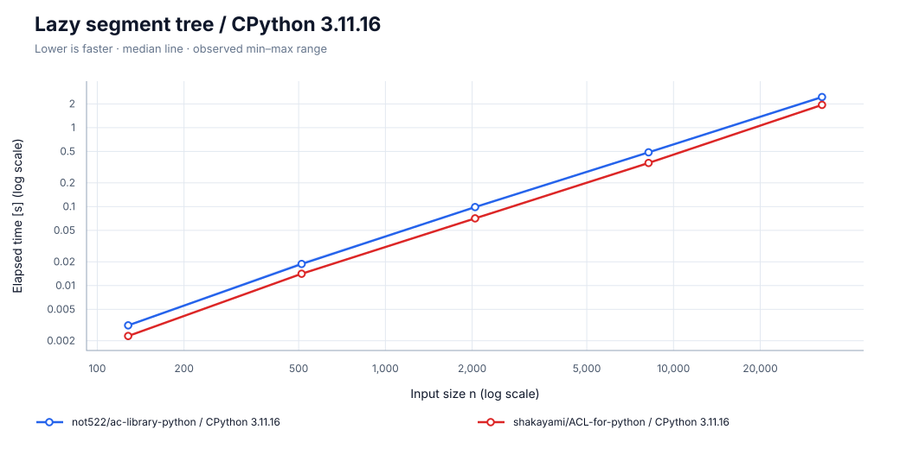

[SVG を保存](charts/lazysegtree/cpython.svg)

タイムアウト（グラフから除外）: harurun n=32768, harurun n=131072, harurun n=500000, not522 n=8192, not522 n=32768, not522 n=131072, not522 n=500000, shakayami n=32768, shakayami n=131072, shakayami n=500000

### PyPy 3.11.13

[SVG を保存](charts/lazysegtree/pypy.svg)

タイムアウト（グラフから除外）: harurun n=131072, harurun n=500000, not522 n=131072, not522 n=500000, shakayami n=131072, shakayami n=500000

**参考用：C++単体の実行時間（Pythonとの値変換・プロセス起動・入出力を除外）。**

- C++ ACL（参考用）: 2026-09-27T22:06:04.507733+00:00; g++ \(Ubuntu 13.3.0-6ubuntu2~24.04.1\) 13.3.0 \| -std=c++17 -O3 -DNDEBUG -march=native; timeout n=\[\]

### 計測情報

| ランタイム | 計測日時 | CPU | repeat / warmup / seed | JSON |
| --- | --- | --- | --- | --- |
| CPython 3.11.16 | 2026-09-27T21:48:19.656326+00:00 | AMD EPYC 7763 64-Core Processor | 5 / 3 / 42 | [data](data/cpython/lazysegtree.json) |
| PyPy 3.11.13 | 2026-09-27T21:59:49.266810+00:00 | AMD EPYC 7763 64-Core Processor | 5 / 3 / 42 | [data](data/pypy/lazysegtree.json) |

- CPython 3.11.16: commit `ba4c9fde1991ed96f526d42396ff2a003d0a7a73`; OS: Linux-6.17.0-1022-azure-x86\_64-with-glibc2.39
  - n=\[128, 512, 2048, 8192, 32768, 131072, 500000\]; warmup_seconds=0.25; sample_seconds=0.025
  - build: 3.11.16 \(main, Aug 13 2026, 02:46:14\) \[GCC 13.3.0\]
  - harurun: https://github.com/lif4635/harurun-s-library.git @ `7c94b7bb0c9d4f6ed0ffa44853febee1e7971ff9`
  - not522: https://github.com/not522/ac-library-python.git @ `27fdbb71cd0d566bdeb12746db59c9d908c6b5d5`
  - shakayami: https://github.com/shakayami/ACL-for-python.git @ `880ed3fc236c9628d674363768bcf203fbb84a8d`
- PyPy 3.11.13: commit `ba4c9fde1991ed96f526d42396ff2a003d0a7a73`; OS: Linux-6.17.0-1022-azure-x86\_64-with-glibc2.39
  - n=\[128, 512, 2048, 8192, 32768, 131072, 500000\]; warmup_seconds=0.25; sample_seconds=0.025
  - build: 3.11.13 \(413c9b7f57f5, Jul 03 2025, 18:03:56\) \[PyPy 7.3.20 with GCC 10.2.1 20210130 \(Red Hat 10.2.1-11\)\]
  - harurun: https://github.com/lif4635/harurun-s-library.git @ `7c94b7bb0c9d4f6ed0ffa44853febee1e7971ff9`
  - not522: https://github.com/not522/ac-library-python.git @ `27fdbb71cd0d566bdeb12746db59c9d908c6b5d5`
  - shakayami: https://github.com/shakayami/ACL-for-python.git @ `880ed3fc236c9628d674363768bcf203fbb84a8d`

## LCP array

長さ n の ASCII 文字列と計測外で生成した suffix array から LCP を計算。

### CPython 3.11.16

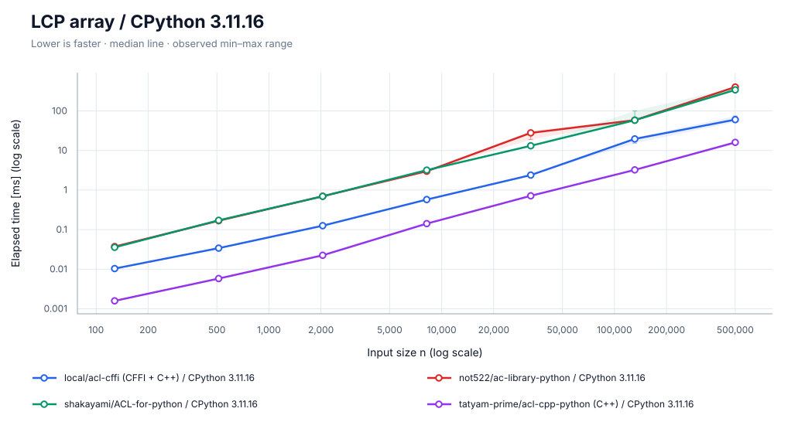

[SVG を保存](charts/lcp_array/cpython.svg)

タイムアウト（グラフから除外）: harurun n=500000, hpy\_universal n=500000, not522 n=500000, shakayami n=500000

### PyPy 3.11.13

[SVG を保存](charts/lcp_array/pypy.svg)

タイムアウト（グラフから除外）: hpy\_universal n=500000, tatyam n=500000

**参考用：C++単体の実行時間（Pythonとの値変換・プロセス起動・入出力を除外）。**

- C++ ACL（参考用）: 2026-09-27T22:06:10.417628+00:00; g++ \(Ubuntu 13.3.0-6ubuntu2~24.04.1\) 13.3.0 \| -std=c++17 -O3 -DNDEBUG -march=native; timeout n=\[\]

### 計測情報

| ランタイム | 計測日時 | CPU | repeat / warmup / seed | JSON |
| --- | --- | --- | --- | --- |
| CPython 3.11.16 | 2026-09-27T21:49:05.058015+00:00 | AMD EPYC 7763 64-Core Processor | 5 / 3 / 42 | [data](data/cpython/lcp_array.json) |
| PyPy 3.11.13 | 2026-09-27T22:00:38.040022+00:00 | AMD EPYC 7763 64-Core Processor | 5 / 3 / 42 | [data](data/pypy/lcp_array.json) |

- CPython 3.11.16: commit `ba4c9fde1991ed96f526d42396ff2a003d0a7a73`; OS: Linux-6.17.0-1022-azure-x86\_64-with-glibc2.39
  - n=\[128, 512, 2048, 8192, 32768, 131072, 500000\]; warmup_seconds=0.25; sample_seconds=0.025
  - build: 3.11.16 \(main, Aug 13 2026, 02:46:14\) \[GCC 13.3.0\]
  - cffi: https://github.com/atcoder/ac-library.git @ `864245a00b00dd008d1abfdc239618fdb7d139da`
  - harurun: https://github.com/lif4635/harurun-s-library.git @ `7c94b7bb0c9d4f6ed0ffa44853febee1e7971ff9`
  - hpy: https://github.com/atcoder/ac-library.git @ `864245a00b00dd008d1abfdc239618fdb7d139da`
  - not522: https://github.com/not522/ac-library-python.git @ `27fdbb71cd0d566bdeb12746db59c9d908c6b5d5`
  - shakayami: https://github.com/shakayami/ACL-for-python.git @ `880ed3fc236c9628d674363768bcf203fbb84a8d`
  - tatyam: https://github.com/tatyam-prime/acl-cpp-python.git @ `b677fa437bdc1b0b7a4512d360de065cdca5778c`
- PyPy 3.11.13: commit `ba4c9fde1991ed96f526d42396ff2a003d0a7a73`; OS: Linux-6.17.0-1022-azure-x86\_64-with-glibc2.39
  - n=\[128, 512, 2048, 8192, 32768, 131072, 500000\]; warmup_seconds=0.25; sample_seconds=0.025
  - build: 3.11.13 \(413c9b7f57f5, Jul 03 2025, 18:03:56\) \[PyPy 7.3.20 with GCC 10.2.1 20210130 \(Red Hat 10.2.1-11\)\]
  - cffi: https://github.com/atcoder/ac-library.git @ `864245a00b00dd008d1abfdc239618fdb7d139da`
  - harurun: https://github.com/lif4635/harurun-s-library.git @ `7c94b7bb0c9d4f6ed0ffa44853febee1e7971ff9`
  - hpy: https://github.com/atcoder/ac-library.git @ `864245a00b00dd008d1abfdc239618fdb7d139da`
  - not522: https://github.com/not522/ac-library-python.git @ `27fdbb71cd0d566bdeb12746db59c9d908c6b5d5`
  - shakayami: https://github.com/shakayami/ACL-for-python.git @ `880ed3fc236c9628d674363768bcf203fbb84a8d`
  - tatyam: https://github.com/tatyam-prime/acl-cpp-python.git @ `b677fa437bdc1b0b7a4512d360de065cdca5778c`

## Maximum flow

左右 n 頂点ずつの疎な二部グラフ。各左頂点から 4 辺。ネットワーク構築と最大流を計測。

### CPython 3.11.16

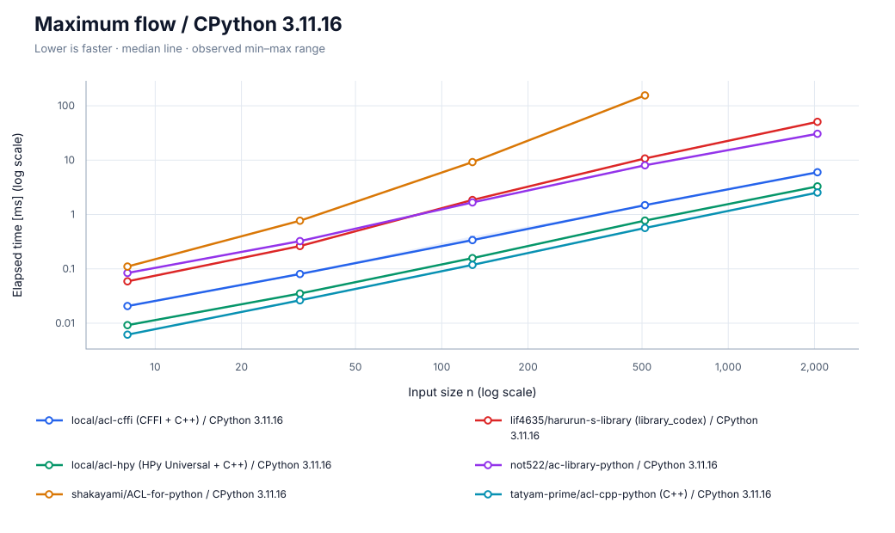

[SVG を保存](charts/maxflow/cpython.svg)

タイムアウト（グラフから除外）: shakayami n=2048

### PyPy 3.11.13

[SVG を保存](charts/maxflow/pypy.svg)

タイムアウト（グラフから除外）: shakayami n=2048

**参考用：C++単体の実行時間（Pythonとの値変換・プロセス起動・入出力を除外）。**

- C++ ACL（参考用）: 2026-09-27T22:06:12.341240+00:00; g++ \(Ubuntu 13.3.0-6ubuntu2~24.04.1\) 13.3.0 \| -std=c++17 -O3 -DNDEBUG -march=native; timeout n=\[\]

### 計測情報

| ランタイム | 計測日時 | CPU | repeat / warmup / seed | JSON |
| --- | --- | --- | --- | --- |
| CPython 3.11.16 | 2026-09-27T21:49:24.885359+00:00 | AMD EPYC 7763 64-Core Processor | 5 / 3 / 42 | [data](data/cpython/maxflow.json) |
| PyPy 3.11.13 | 2026-09-27T22:01:00.801205+00:00 | AMD EPYC 7763 64-Core Processor | 5 / 3 / 42 | [data](data/pypy/maxflow.json) |

- CPython 3.11.16: commit `ba4c9fde1991ed96f526d42396ff2a003d0a7a73`; OS: Linux-6.17.0-1022-azure-x86\_64-with-glibc2.39
  - n=\[8, 32, 128, 512, 2048\]; warmup_seconds=0.25; sample_seconds=0.025
  - build: 3.11.16 \(main, Aug 13 2026, 02:46:14\) \[GCC 13.3.0\]
  - cffi: https://github.com/atcoder/ac-library.git @ `864245a00b00dd008d1abfdc239618fdb7d139da`
  - harurun: https://github.com/lif4635/harurun-s-library.git @ `7c94b7bb0c9d4f6ed0ffa44853febee1e7971ff9`
  - hpy: https://github.com/atcoder/ac-library.git @ `864245a00b00dd008d1abfdc239618fdb7d139da`
  - not522: https://github.com/not522/ac-library-python.git @ `27fdbb71cd0d566bdeb12746db59c9d908c6b5d5`
  - shakayami: https://github.com/shakayami/ACL-for-python.git @ `880ed3fc236c9628d674363768bcf203fbb84a8d`
  - tatyam: https://github.com/tatyam-prime/acl-cpp-python.git @ `b677fa437bdc1b0b7a4512d360de065cdca5778c`
- PyPy 3.11.13: commit `ba4c9fde1991ed96f526d42396ff2a003d0a7a73`; OS: Linux-6.17.0-1022-azure-x86\_64-with-glibc2.39
  - n=\[8, 32, 128, 512, 2048\]; warmup_seconds=0.25; sample_seconds=0.025
  - build: 3.11.13 \(413c9b7f57f5, Jul 03 2025, 18:03:56\) \[PyPy 7.3.20 with GCC 10.2.1 20210130 \(Red Hat 10.2.1-11\)\]
  - cffi: https://github.com/atcoder/ac-library.git @ `864245a00b00dd008d1abfdc239618fdb7d139da`
  - harurun: https://github.com/lif4635/harurun-s-library.git @ `7c94b7bb0c9d4f6ed0ffa44853febee1e7971ff9`
  - hpy: https://github.com/atcoder/ac-library.git @ `864245a00b00dd008d1abfdc239618fdb7d139da`
  - not522: https://github.com/not522/ac-library-python.git @ `27fdbb71cd0d566bdeb12746db59c9d908c6b5d5`
  - shakayami: https://github.com/shakayami/ACL-for-python.git @ `880ed3fc236c9628d674363768bcf203fbb84a8d`
  - tatyam: https://github.com/tatyam-prime/acl-cpp-python.git @ `b677fa437bdc1b0b7a4512d360de065cdca5778c`

## Minimum-cost flow

左右 n 頂点ずつの二部グラフ。各左頂点から 3 辺、非負コスト。構築と最小費用最大流を計測。

### CPython 3.11.16

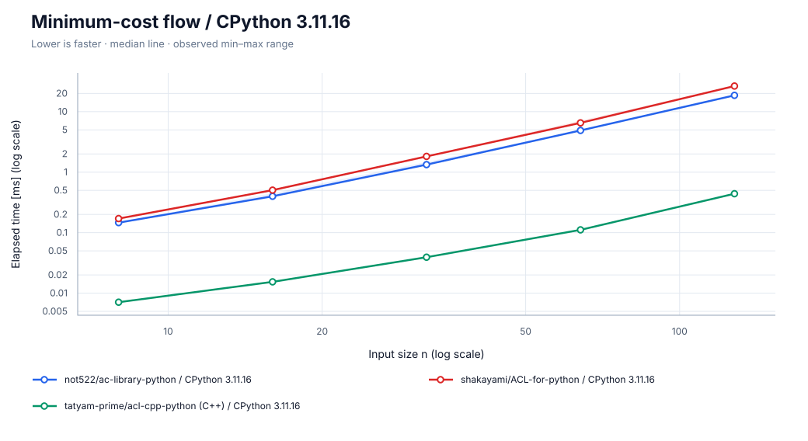

[SVG を保存](charts/mincostflow/cpython.svg)

### PyPy 3.11.13

[SVG を保存](charts/mincostflow/pypy.svg)

**参考用：C++単体の実行時間（Pythonとの値変換・プロセス起動・入出力を除外）。**

- C++ ACL（参考用）: 2026-09-27T22:06:14.209051+00:00; g++ \(Ubuntu 13.3.0-6ubuntu2~24.04.1\) 13.3.0 \| -std=c++17 -O3 -DNDEBUG -march=native; timeout n=\[\]

### 計測情報

| ランタイム | 計測日時 | CPU | repeat / warmup / seed | JSON |
| --- | --- | --- | --- | --- |
| CPython 3.11.16 | 2026-09-27T21:49:39.734732+00:00 | AMD EPYC 7763 64-Core Processor | 5 / 3 / 42 | [data](data/cpython/mincostflow.json) |
| PyPy 3.11.13 | 2026-09-27T22:01:19.487010+00:00 | AMD EPYC 7763 64-Core Processor | 5 / 3 / 42 | [data](data/pypy/mincostflow.json) |

- CPython 3.11.16: commit `ba4c9fde1991ed96f526d42396ff2a003d0a7a73`; OS: Linux-6.17.0-1022-azure-x86\_64-with-glibc2.39
  - n=\[8, 16, 32, 64, 128\]; warmup_seconds=0.25; sample_seconds=0.025
  - build: 3.11.16 \(main, Aug 13 2026, 02:46:14\) \[GCC 13.3.0\]
  - cffi: https://github.com/atcoder/ac-library.git @ `864245a00b00dd008d1abfdc239618fdb7d139da`
  - harurun: https://github.com/lif4635/harurun-s-library.git @ `7c94b7bb0c9d4f6ed0ffa44853febee1e7971ff9`
  - hpy: https://github.com/atcoder/ac-library.git @ `864245a00b00dd008d1abfdc239618fdb7d139da`
  - not522: https://github.com/not522/ac-library-python.git @ `27fdbb71cd0d566bdeb12746db59c9d908c6b5d5`
  - shakayami: https://github.com/shakayami/ACL-for-python.git @ `880ed3fc236c9628d674363768bcf203fbb84a8d`
  - tatyam: https://github.com/tatyam-prime/acl-cpp-python.git @ `b677fa437bdc1b0b7a4512d360de065cdca5778c`
- PyPy 3.11.13: commit `ba4c9fde1991ed96f526d42396ff2a003d0a7a73`; OS: Linux-6.17.0-1022-azure-x86\_64-with-glibc2.39
  - n=\[8, 16, 32, 64, 128\]; warmup_seconds=0.25; sample_seconds=0.025
  - build: 3.11.13 \(413c9b7f57f5, Jul 03 2025, 18:03:56\) \[PyPy 7.3.20 with GCC 10.2.1 20210130 \(Red Hat 10.2.1-11\)\]
  - cffi: https://github.com/atcoder/ac-library.git @ `864245a00b00dd008d1abfdc239618fdb7d139da`
  - harurun: https://github.com/lif4635/harurun-s-library.git @ `7c94b7bb0c9d4f6ed0ffa44853febee1e7971ff9`
  - hpy: https://github.com/atcoder/ac-library.git @ `864245a00b00dd008d1abfdc239618fdb7d139da`
  - not522: https://github.com/not522/ac-library-python.git @ `27fdbb71cd0d566bdeb12746db59c9d908c6b5d5`
  - shakayami: https://github.com/shakayami/ACL-for-python.git @ `880ed3fc236c9628d674363768bcf203fbb84a8d`
  - tatyam: https://github.com/tatyam-prime/acl-cpp-python.git @ `b677fa437bdc1b0b7a4512d360de065cdca5778c`

## Strongly connected components

n 頂点・4n 辺。小さいブロック内の辺と前方への辺を混在。グラフ構築と結果の正規化も計測。

### CPython 3.11.16

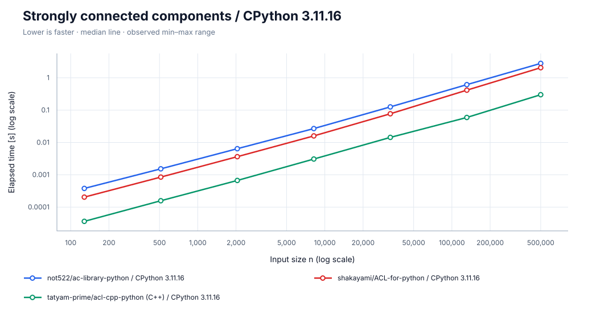

[SVG を保存](charts/scc/cpython.svg)

タイムアウト（グラフから除外）: cffi n=500000, harurun n=131072, harurun n=500000, hpy\_universal n=500000, not522 n=131072, not522 n=500000, shakayami n=131072, shakayami n=500000, tatyam n=500000

### PyPy 3.11.13

[SVG を保存](charts/scc/pypy.svg)

タイムアウト（グラフから除外）: cffi n=500000, harurun n=131072, harurun n=500000, hpy\_universal n=500000, not522 n=500000, shakayami n=500000, tatyam n=131072, tatyam n=500000

**参考用：C++単体の実行時間（Pythonとの値変換・プロセス起動・入出力を除外）。**

- C++ ACL（参考用）: 2026-09-27T22:06:21.890789+00:00; g++ \(Ubuntu 13.3.0-6ubuntu2~24.04.1\) 13.3.0 \| -std=c++17 -O3 -DNDEBUG -march=native; timeout n=\[\]

### 計測情報

| ランタイム | 計測日時 | CPU | repeat / warmup / seed | JSON |
| --- | --- | --- | --- | --- |
| CPython 3.11.16 | 2026-09-27T21:50:42.643604+00:00 | AMD EPYC 7763 64-Core Processor | 5 / 3 / 42 | [data](data/cpython/scc.json) |
| PyPy 3.11.13 | 2026-09-27T22:02:28.058096+00:00 | AMD EPYC 7763 64-Core Processor | 5 / 3 / 42 | [data](data/pypy/scc.json) |

- CPython 3.11.16: commit `ba4c9fde1991ed96f526d42396ff2a003d0a7a73`; OS: Linux-6.17.0-1022-azure-x86\_64-with-glibc2.39
  - n=\[128, 512, 2048, 8192, 32768, 131072, 500000\]; warmup_seconds=0.25; sample_seconds=0.025
  - build: 3.11.16 \(main, Aug 13 2026, 02:46:14\) \[GCC 13.3.0\]
  - cffi: https://github.com/atcoder/ac-library.git @ `864245a00b00dd008d1abfdc239618fdb7d139da`
  - harurun: https://github.com/lif4635/harurun-s-library.git @ `7c94b7bb0c9d4f6ed0ffa44853febee1e7971ff9`
  - hpy: https://github.com/atcoder/ac-library.git @ `864245a00b00dd008d1abfdc239618fdb7d139da`
  - not522: https://github.com/not522/ac-library-python.git @ `27fdbb71cd0d566bdeb12746db59c9d908c6b5d5`
  - shakayami: https://github.com/shakayami/ACL-for-python.git @ `880ed3fc236c9628d674363768bcf203fbb84a8d`
  - tatyam: https://github.com/tatyam-prime/acl-cpp-python.git @ `b677fa437bdc1b0b7a4512d360de065cdca5778c`
- PyPy 3.11.13: commit `ba4c9fde1991ed96f526d42396ff2a003d0a7a73`; OS: Linux-6.17.0-1022-azure-x86\_64-with-glibc2.39
  - n=\[128, 512, 2048, 8192, 32768, 131072, 500000\]; warmup_seconds=0.25; sample_seconds=0.025
  - build: 3.11.13 \(413c9b7f57f5, Jul 03 2025, 18:03:56\) \[PyPy 7.3.20 with GCC 10.2.1 20210130 \(Red Hat 10.2.1-11\)\]
  - cffi: https://github.com/atcoder/ac-library.git @ `864245a00b00dd008d1abfdc239618fdb7d139da`
  - harurun: https://github.com/lif4635/harurun-s-library.git @ `7c94b7bb0c9d4f6ed0ffa44853febee1e7971ff9`
  - hpy: https://github.com/atcoder/ac-library.git @ `864245a00b00dd008d1abfdc239618fdb7d139da`
  - not522: https://github.com/not522/ac-library-python.git @ `27fdbb71cd0d566bdeb12746db59c9d908c6b5d5`
  - shakayami: https://github.com/shakayami/ACL-for-python.git @ `880ed3fc236c9628d674363768bcf203fbb84a8d`
  - tatyam: https://github.com/tatyam-prime/acl-cpp-python.git @ `b677fa437bdc1b0b7a4512d360de065cdca5778c`

## Segment tree

n 要素・4n 回の一点更新 / 区間和。構築も計測。C++ 版には公開 API がないため Python 2 実装を比較。

### CPython 3.11.16

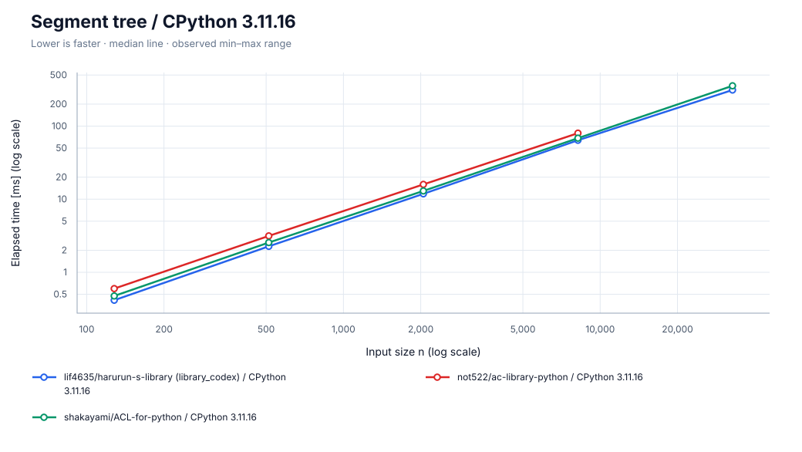

[SVG を保存](charts/segtree/cpython.svg)

タイムアウト（グラフから除外）: harurun n=131072, harurun n=500000, not522 n=32768, not522 n=131072, not522 n=500000, shakayami n=131072, shakayami n=500000

### PyPy 3.11.13

[SVG を保存](charts/segtree/pypy.svg)

タイムアウト（グラフから除外）: harurun n=500000, not522 n=500000, shakayami n=500000

**参考用：C++単体の実行時間（Pythonとの値変換・プロセス起動・入出力を除外）。**

- C++ ACL（参考用）: 2026-09-27T22:06:29.606682+00:00; g++ \(Ubuntu 13.3.0-6ubuntu2~24.04.1\) 13.3.0 \| -std=c++17 -O3 -DNDEBUG -march=native; timeout n=\[\]

### 計測情報

| ランタイム | 計測日時 | CPU | repeat / warmup / seed | JSON |
| --- | --- | --- | --- | --- |
| CPython 3.11.16 | 2026-09-27T21:51:24.805826+00:00 | AMD EPYC 7763 64-Core Processor | 5 / 3 / 42 | [data](data/cpython/segtree.json) |
| PyPy 3.11.13 | 2026-09-27T22:02:59.147375+00:00 | AMD EPYC 7763 64-Core Processor | 5 / 3 / 42 | [data](data/pypy/segtree.json) |

- CPython 3.11.16: commit `ba4c9fde1991ed96f526d42396ff2a003d0a7a73`; OS: Linux-6.17.0-1022-azure-x86\_64-with-glibc2.39
  - n=\[128, 512, 2048, 8192, 32768, 131072, 500000\]; warmup_seconds=0.25; sample_seconds=0.025
  - build: 3.11.16 \(main, Aug 13 2026, 02:46:14\) \[GCC 13.3.0\]
  - harurun: https://github.com/lif4635/harurun-s-library.git @ `7c94b7bb0c9d4f6ed0ffa44853febee1e7971ff9`
  - not522: https://github.com/not522/ac-library-python.git @ `27fdbb71cd0d566bdeb12746db59c9d908c6b5d5`
  - shakayami: https://github.com/shakayami/ACL-for-python.git @ `880ed3fc236c9628d674363768bcf203fbb84a8d`
- PyPy 3.11.13: commit `ba4c9fde1991ed96f526d42396ff2a003d0a7a73`; OS: Linux-6.17.0-1022-azure-x86\_64-with-glibc2.39
  - n=\[128, 512, 2048, 8192, 32768, 131072, 500000\]; warmup_seconds=0.25; sample_seconds=0.025
  - build: 3.11.13 \(413c9b7f57f5, Jul 03 2025, 18:03:56\) \[PyPy 7.3.20 with GCC 10.2.1 20210130 \(Red Hat 10.2.1-11\)\]
  - harurun: https://github.com/lif4635/harurun-s-library.git @ `7c94b7bb0c9d4f6ed0ffa44853febee1e7971ff9`
  - not522: https://github.com/not522/ac-library-python.git @ `27fdbb71cd0d566bdeb12746db59c9d908c6b5d5`
  - shakayami: https://github.com/shakayami/ACL-for-python.git @ `880ed3fc236c9628d674363768bcf203fbb84a8d`

## Suffix array

長さ n の ASCII 文字列の suffix array。Python/C++ 間の変換も含む。

### CPython 3.11.16

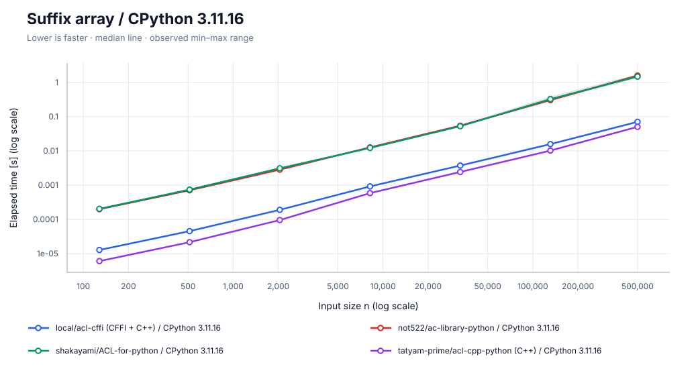

[SVG を保存](charts/suffix_array/cpython.svg)

タイムアウト（グラフから除外）: harurun n=500000, not522 n=500000, shakayami n=500000

### PyPy 3.11.13

[SVG を保存](charts/suffix_array/pypy.svg)

**参考用：C++単体の実行時間（Pythonとの値変換・プロセス起動・入出力を除外）。**

- C++ ACL（参考用）: 2026-09-27T22:06:32.720093+00:00; g++ \(Ubuntu 13.3.0-6ubuntu2~24.04.1\) 13.3.0 \| -std=c++17 -O3 -DNDEBUG -march=native; timeout n=\[\]

### 計測情報

| ランタイム | 計測日時 | CPU | repeat / warmup / seed | JSON |
| --- | --- | --- | --- | --- |
| CPython 3.11.16 | 2026-09-27T21:52:04.463996+00:00 | AMD EPYC 7763 64-Core Processor | 5 / 3 / 42 | [data](data/cpython/suffix_array.json) |
| PyPy 3.11.13 | 2026-09-27T22:03:37.684174+00:00 | AMD EPYC 7763 64-Core Processor | 5 / 3 / 42 | [data](data/pypy/suffix_array.json) |

- CPython 3.11.16: commit `ba4c9fde1991ed96f526d42396ff2a003d0a7a73`; OS: Linux-6.17.0-1022-azure-x86\_64-with-glibc2.39
  - n=\[128, 512, 2048, 8192, 32768, 131072, 500000\]; warmup_seconds=0.25; sample_seconds=0.025
  - build: 3.11.16 \(main, Aug 13 2026, 02:46:14\) \[GCC 13.3.0\]
  - cffi: https://github.com/atcoder/ac-library.git @ `864245a00b00dd008d1abfdc239618fdb7d139da`
  - harurun: https://github.com/lif4635/harurun-s-library.git @ `7c94b7bb0c9d4f6ed0ffa44853febee1e7971ff9`
  - hpy: https://github.com/atcoder/ac-library.git @ `864245a00b00dd008d1abfdc239618fdb7d139da`
  - not522: https://github.com/not522/ac-library-python.git @ `27fdbb71cd0d566bdeb12746db59c9d908c6b5d5`
  - shakayami: https://github.com/shakayami/ACL-for-python.git @ `880ed3fc236c9628d674363768bcf203fbb84a8d`
  - tatyam: https://github.com/tatyam-prime/acl-cpp-python.git @ `b677fa437bdc1b0b7a4512d360de065cdca5778c`
- PyPy 3.11.13: commit `ba4c9fde1991ed96f526d42396ff2a003d0a7a73`; OS: Linux-6.17.0-1022-azure-x86\_64-with-glibc2.39
  - n=\[128, 512, 2048, 8192, 32768, 131072, 500000\]; warmup_seconds=0.25; sample_seconds=0.025
  - build: 3.11.13 \(413c9b7f57f5, Jul 03 2025, 18:03:56\) \[PyPy 7.3.20 with GCC 10.2.1 20210130 \(Red Hat 10.2.1-11\)\]
  - cffi: https://github.com/atcoder/ac-library.git @ `864245a00b00dd008d1abfdc239618fdb7d139da`
  - harurun: https://github.com/lif4635/harurun-s-library.git @ `7c94b7bb0c9d4f6ed0ffa44853febee1e7971ff9`
  - hpy: https://github.com/atcoder/ac-library.git @ `864245a00b00dd008d1abfdc239618fdb7d139da`
  - not522: https://github.com/not522/ac-library-python.git @ `27fdbb71cd0d566bdeb12746db59c9d908c6b5d5`
  - shakayami: https://github.com/shakayami/ACL-for-python.git @ `880ed3fc236c9628d674363768bcf203fbb84a8d`
  - tatyam: https://github.com/tatyam-prime/acl-cpp-python.git @ `b677fa437bdc1b0b7a4512d360de065cdca5778c`

## 2-SAT

n 変数・4n 節。充足可能なランダム式の構築と求解。返り値は充足可能性と解の整合性。

### CPython 3.11.16

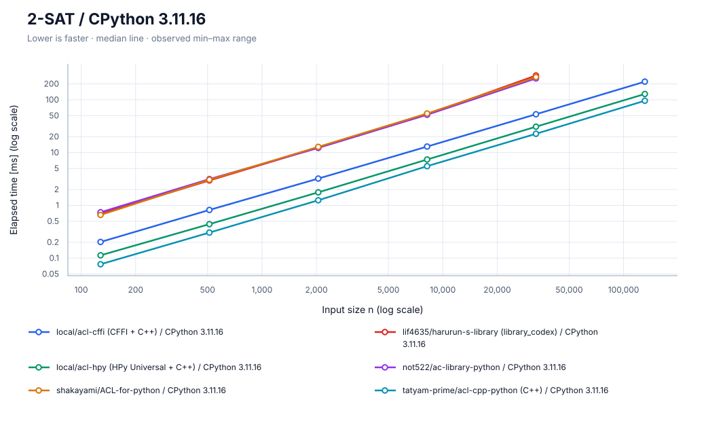

[SVG を保存](charts/two_sat/cpython.svg)

タイムアウト（グラフから除外）: cffi n=500000, harurun n=131072, harurun n=500000, hpy\_universal n=500000, not522 n=131072, not522 n=500000, shakayami n=131072, shakayami n=500000, tatyam n=500000

### PyPy 3.11.13

[SVG を保存](charts/two_sat/pypy.svg)

タイムアウト（グラフから除外）: cffi n=500000, harurun n=131072, harurun n=500000, hpy\_universal n=131072, hpy\_universal n=500000, not522 n=131072, not522 n=500000, shakayami n=500000, tatyam n=131072, tatyam n=500000

**参考用：C++単体の実行時間（Pythonとの値変換・プロセス起動・入出力を除外）。**

- C++ ACL（参考用）: 2026-09-27T22:06:42.310069+00:00; g++ \(Ubuntu 13.3.0-6ubuntu2~24.04.1\) 13.3.0 \| -std=c++17 -O3 -DNDEBUG -march=native; timeout n=\[\]

### 計測情報

| ランタイム | 計測日時 | CPU | repeat / warmup / seed | JSON |
| --- | --- | --- | --- | --- |
| CPython 3.11.16 | 2026-09-27T21:53:15.129638+00:00 | AMD EPYC 7763 64-Core Processor | 5 / 3 / 42 | [data](data/cpython/two_sat.json) |
| PyPy 3.11.13 | 2026-09-27T22:04:54.445076+00:00 | AMD EPYC 7763 64-Core Processor | 5 / 3 / 42 | [data](data/pypy/two_sat.json) |

- CPython 3.11.16: commit `ba4c9fde1991ed96f526d42396ff2a003d0a7a73`; OS: Linux-6.17.0-1022-azure-x86\_64-with-glibc2.39
  - n=\[128, 512, 2048, 8192, 32768, 131072, 500000\]; warmup_seconds=0.25; sample_seconds=0.025
  - build: 3.11.16 \(main, Aug 13 2026, 02:46:14\) \[GCC 13.3.0\]
  - cffi: https://github.com/atcoder/ac-library.git @ `864245a00b00dd008d1abfdc239618fdb7d139da`
  - harurun: https://github.com/lif4635/harurun-s-library.git @ `7c94b7bb0c9d4f6ed0ffa44853febee1e7971ff9`
  - hpy: https://github.com/atcoder/ac-library.git @ `864245a00b00dd008d1abfdc239618fdb7d139da`
  - not522: https://github.com/not522/ac-library-python.git @ `27fdbb71cd0d566bdeb12746db59c9d908c6b5d5`
  - shakayami: https://github.com/shakayami/ACL-for-python.git @ `880ed3fc236c9628d674363768bcf203fbb84a8d`
  - tatyam: https://github.com/tatyam-prime/acl-cpp-python.git @ `b677fa437bdc1b0b7a4512d360de065cdca5778c`
- PyPy 3.11.13: commit `ba4c9fde1991ed96f526d42396ff2a003d0a7a73`; OS: Linux-6.17.0-1022-azure-x86\_64-with-glibc2.39
  - n=\[128, 512, 2048, 8192, 32768, 131072, 500000\]; warmup_seconds=0.25; sample_seconds=0.025
  - build: 3.11.13 \(413c9b7f57f5, Jul 03 2025, 18:03:56\) \[PyPy 7.3.20 with GCC 10.2.1 20210130 \(Red Hat 10.2.1-11\)\]
  - cffi: https://github.com/atcoder/ac-library.git @ `864245a00b00dd008d1abfdc239618fdb7d139da`
  - harurun: https://github.com/lif4635/harurun-s-library.git @ `7c94b7bb0c9d4f6ed0ffa44853febee1e7971ff9`
  - hpy: https://github.com/atcoder/ac-library.git @ `864245a00b00dd008d1abfdc239618fdb7d139da`
  - not522: https://github.com/not522/ac-library-python.git @ `27fdbb71cd0d566bdeb12746db59c9d908c6b5d5`
  - shakayami: https://github.com/shakayami/ACL-for-python.git @ `880ed3fc236c9628d674363768bcf203fbb84a8d`
  - tatyam: https://github.com/tatyam-prime/acl-cpp-python.git @ `b677fa437bdc1b0b7a4512d360de065cdca5778c`

## Z algorithm

長さ n の ASCII 文字列の Z 配列。Python/C++ 間の変換も含む。

### CPython 3.11.16

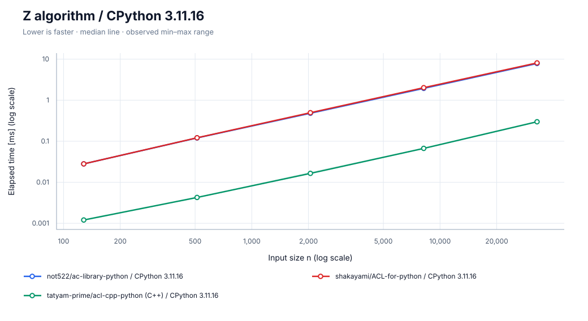

[SVG を保存](charts/z_algorithm/cpython.svg)

### PyPy 3.11.13

[SVG を保存](charts/z_algorithm/pypy.svg)

**参考用：C++単体の実行時間（Pythonとの値変換・プロセス起動・入出力を除外）。**

- C++ ACL（参考用）: 2026-09-27T22:06:45.126570+00:00; g++ \(Ubuntu 13.3.0-6ubuntu2~24.04.1\) 13.3.0 \| -std=c++17 -O3 -DNDEBUG -march=native; timeout n=\[\]

### 計測情報

| ランタイム | 計測日時 | CPU | repeat / warmup / seed | JSON |
| --- | --- | --- | --- | --- |
| CPython 3.11.16 | 2026-09-27T21:53:40.819861+00:00 | AMD EPYC 7763 64-Core Processor | 5 / 3 / 42 | [data](data/cpython/z_algorithm.json) |
| PyPy 3.11.13 | 2026-09-27T22:05:27.330132+00:00 | AMD EPYC 7763 64-Core Processor | 5 / 3 / 42 | [data](data/pypy/z_algorithm.json) |

- CPython 3.11.16: commit `ba4c9fde1991ed96f526d42396ff2a003d0a7a73`; OS: Linux-6.17.0-1022-azure-x86\_64-with-glibc2.39
  - n=\[128, 512, 2048, 8192, 32768, 131072, 500000\]; warmup_seconds=0.25; sample_seconds=0.025
  - build: 3.11.16 \(main, Aug 13 2026, 02:46:14\) \[GCC 13.3.0\]
  - cffi: https://github.com/atcoder/ac-library.git @ `864245a00b00dd008d1abfdc239618fdb7d139da`
  - harurun: https://github.com/lif4635/harurun-s-library.git @ `7c94b7bb0c9d4f6ed0ffa44853febee1e7971ff9`
  - hpy: https://github.com/atcoder/ac-library.git @ `864245a00b00dd008d1abfdc239618fdb7d139da`
  - not522: https://github.com/not522/ac-library-python.git @ `27fdbb71cd0d566bdeb12746db59c9d908c6b5d5`
  - shakayami: https://github.com/shakayami/ACL-for-python.git @ `880ed3fc236c9628d674363768bcf203fbb84a8d`
  - tatyam: https://github.com/tatyam-prime/acl-cpp-python.git @ `b677fa437bdc1b0b7a4512d360de065cdca5778c`
- PyPy 3.11.13: commit `ba4c9fde1991ed96f526d42396ff2a003d0a7a73`; OS: Linux-6.17.0-1022-azure-x86\_64-with-glibc2.39
  - n=\[128, 512, 2048, 8192, 32768, 131072, 500000\]; warmup_seconds=0.25; sample_seconds=0.025
  - build: 3.11.13 \(413c9b7f57f5, Jul 03 2025, 18:03:56\) \[PyPy 7.3.20 with GCC 10.2.1 20210130 \(Red Hat 10.2.1-11\)\]
  - cffi: https://github.com/atcoder/ac-library.git @ `864245a00b00dd008d1abfdc239618fdb7d139da`
  - harurun: https://github.com/lif4635/harurun-s-library.git @ `7c94b7bb0c9d4f6ed0ffa44853febee1e7971ff9`
  - hpy: https://github.com/atcoder/ac-library.git @ `864245a00b00dd008d1abfdc239618fdb7d139da`
  - not522: https://github.com/not522/ac-library-python.git @ `27fdbb71cd0d566bdeb12746db59c9d908c6b5d5`
  - shakayami: https://github.com/shakayami/ACL-for-python.git @ `880ed3fc236c9628d674363768bcf203fbb84a8d`
  - tatyam: https://github.com/tatyam-prime/acl-cpp-python.git @ `b677fa437bdc1b0b7a4512d360de065cdca5778c`

CI の CPU・負荷・ランタイムのバージョンによって実行時間は変動します。増分計測ではケースやランタイムごとに計測日時が異なります。各グラフの計測情報と JSON を併せて確認してください。
