# Python ACL ベンチマーク

各実装を PyPy で比較します。グラフはランタイムごとに分け、軸の範囲を個別に調整します。グラフは小さいほど高速です。入力サイズ別の線は中央値、帯・ひげは観測された最小値から最大値です。Library Checker のケースは折れ線を表示しません。棒グラフは各系列の全ケース中の最大中央値とケース名を示し、タイムアウトした系列は表示しません。

[HTML レポート](index.html) · [生データ](data/)

## Convolution \(mod 998244353\)

長さ n の 2 配列の畳み込み。FFT インスタンスの初期化・Python/C++ 間の変換も含む。

### PyPy 3.11.13

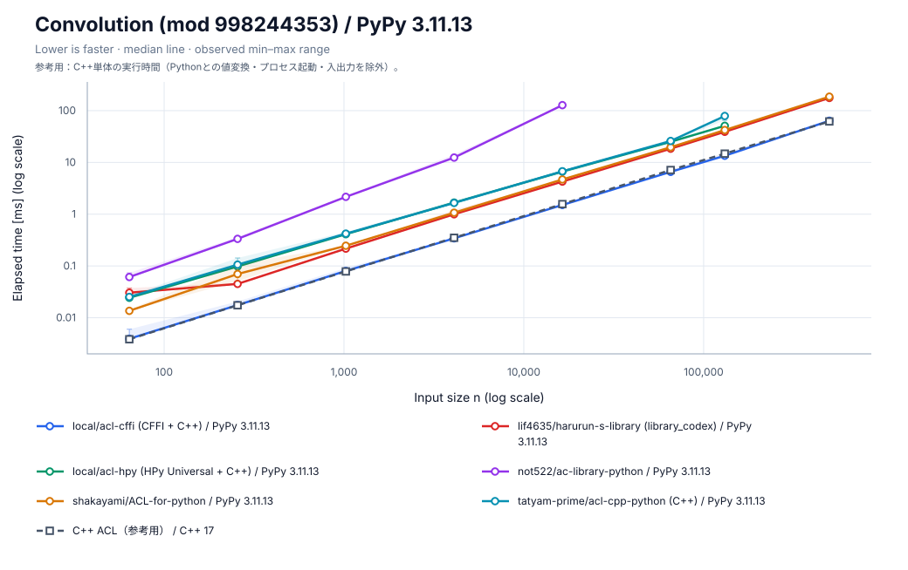

#### 全ケース中の最大中央値（タイムアウトした系列は除外）

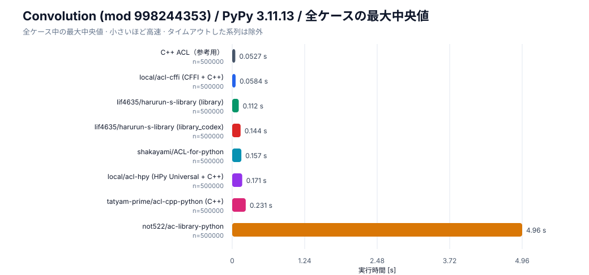

[折れ線 SVG を保存](charts/convolution/pypy.svg) · [全ケースの最大値 SVG を保存](charts/convolution/pypy-max.svg)

**参考用：C++単体の実行時間（Pythonとの値変換・プロセス起動・入出力を除外）。**

- C++ ACL（参考用）: 2026-09-28T08:26:11.079220+00:00; g++ \(Ubuntu 13.3.0-6ubuntu2~24.04.1\) 13.3.0 \| -std=c++17 -O3 -DNDEBUG -march=native; timeout n=\[\]

### 計測情報

| ランタイム | 計測日時 | CPU | repeat / warmup / seed | JSON |
| --- | --- | --- | --- | --- |
| PyPy 3.11.13 | 2026-09-28T07:58:48.680745+00:00 | AMD EPYC 9V45 96-Core Processor | 5 / 3 / 42 | [data](data/pypy/convolution.json) |

- PyPy 3.11.13: commit `5550561a437a3f40e36638539da6e5e17797929e`; OS: Linux-6.17.0-1022-azure-x86\_64-with-glibc2.39
  - n=\[64, 256, 1024, 4096, 16384, 65536, 131072, 500000\]; warmup_seconds=0.25; sample_seconds=0.025
  - build: 3.11.13 \(413c9b7f57f5, Jul 03 2025, 18:03:56\) \[PyPy 7.3.20 with GCC 10.2.1 20210130 \(Red Hat 10.2.1-11\)\]
  - cffi: https://github.com/atcoder/ac-library.git @ `864245a00b00dd008d1abfdc239618fdb7d139da`
  - harurun: https://github.com/lif4635/harurun-s-library.git @ `7c94b7bb0c9d4f6ed0ffa44853febee1e7971ff9`
  - hpy: https://github.com/atcoder/ac-library.git @ `864245a00b00dd008d1abfdc239618fdb7d139da`
  - not522: https://github.com/not522/ac-library-python.git @ `27fdbb71cd0d566bdeb12746db59c9d908c6b5d5`
  - shakayami: https://github.com/shakayami/ACL-for-python.git @ `880ed3fc236c9628d674363768bcf203fbb84a8d`
  - tatyam: https://github.com/tatyam-prime/acl-cpp-python.git @ `b677fa437bdc1b0b7a4512d360de065cdca5778c`

## Chinese remainder theorem

n 組の合同式を処理。各組は 4 個の法、最小公倍数を 64 bit 以内に固定。

### PyPy 3.11.13

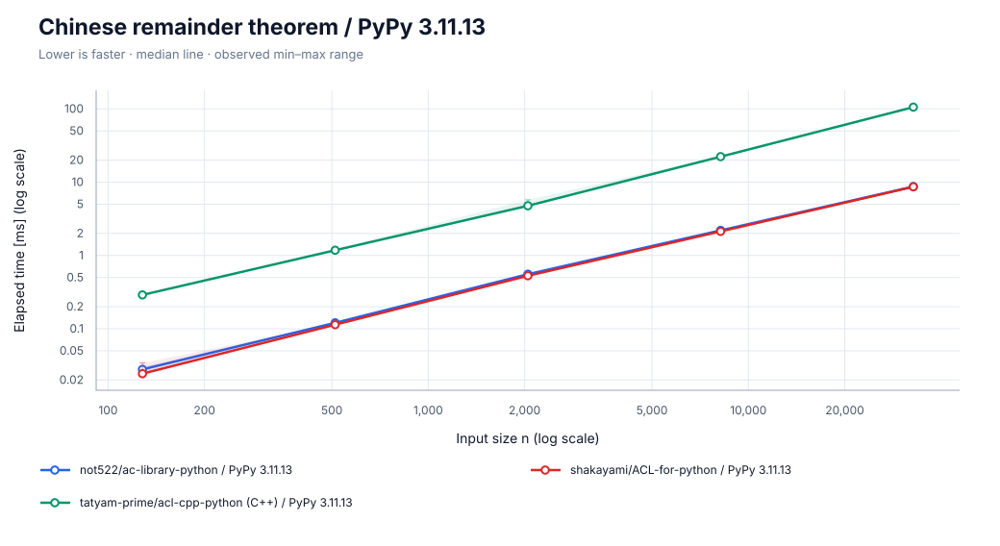

#### 全ケース中の最大中央値（タイムアウトした系列は除外）

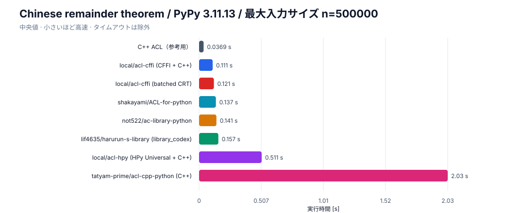

[折れ線 SVG を保存](charts/crt/pypy.svg) · [全ケースの最大値 SVG を保存](charts/crt/pypy-max.svg)

**参考用：C++単体の実行時間（Pythonとの値変換・プロセス起動・入出力を除外）。**

- C++ ACL（参考用）: 2026-09-28T08:26:16.333426+00:00; g++ \(Ubuntu 13.3.0-6ubuntu2~24.04.1\) 13.3.0 \| -std=c++17 -O3 -DNDEBUG -march=native; timeout n=\[\]

### 計測情報

| ランタイム | 計測日時 | CPU | repeat / warmup / seed | JSON |
| --- | --- | --- | --- | --- |
| PyPy 3.11.13 | 2026-09-28T08:00:32.012134+00:00 | AMD EPYC 9V45 96-Core Processor | 5 / 3 / 42 | [data](data/pypy/crt.json) |

- PyPy 3.11.13: commit `5550561a437a3f40e36638539da6e5e17797929e`; OS: Linux-6.17.0-1022-azure-x86\_64-with-glibc2.39
  - n=\[128, 512, 2048, 8192, 32768, 131072, 500000\]; warmup_seconds=0.25; sample_seconds=0.025
  - build: 3.11.13 \(413c9b7f57f5, Jul 03 2025, 18:03:56\) \[PyPy 7.3.20 with GCC 10.2.1 20210130 \(Red Hat 10.2.1-11\)\]
  - cffi: https://github.com/atcoder/ac-library.git @ `864245a00b00dd008d1abfdc239618fdb7d139da`
  - harurun: https://github.com/lif4635/harurun-s-library.git @ `7c94b7bb0c9d4f6ed0ffa44853febee1e7971ff9`
  - hpy: https://github.com/atcoder/ac-library.git @ `864245a00b00dd008d1abfdc239618fdb7d139da`
  - not522: https://github.com/not522/ac-library-python.git @ `27fdbb71cd0d566bdeb12746db59c9d908c6b5d5`
  - shakayami: https://github.com/shakayami/ACL-for-python.git @ `880ed3fc236c9628d674363768bcf203fbb84a8d`
  - tatyam: https://github.com/tatyam-prime/acl-cpp-python.git @ `b677fa437bdc1b0b7a4512d360de065cdca5778c`

## DSU / Union-Find

n 頂点・4n 回の merge / same。初期化と全クエリを計測。

### PyPy 3.11.13

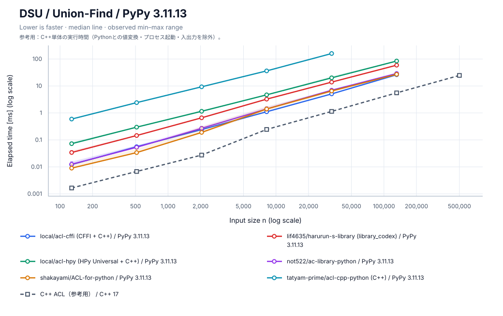

#### 全ケース中の最大中央値（タイムアウトした系列は除外）

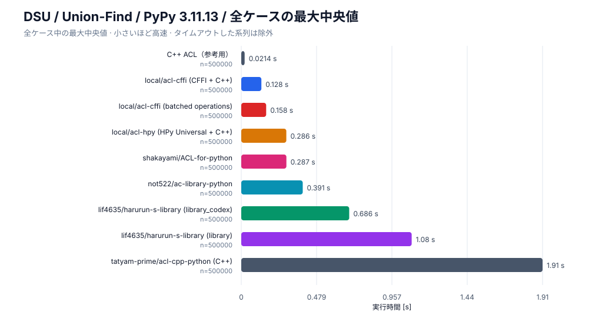

[折れ線 SVG を保存](charts/dsu/pypy.svg) · [全ケースの最大値 SVG を保存](charts/dsu/pypy-max.svg)

**参考用：C++単体の実行時間（Pythonとの値変換・プロセス起動・入出力を除外）。**

- C++ ACL（参考用）: 2026-09-28T08:26:20.869130+00:00; g++ \(Ubuntu 13.3.0-6ubuntu2~24.04.1\) 13.3.0 \| -std=c++17 -O3 -DNDEBUG -march=native; timeout n=\[\]

### 計測情報

| ランタイム | 計測日時 | CPU | repeat / warmup / seed | JSON |
| --- | --- | --- | --- | --- |
| PyPy 3.11.13 | 2026-09-28T08:02:14.667656+00:00 | AMD EPYC 9V45 96-Core Processor | 5 / 3 / 42 | [data](data/pypy/dsu.json) |

- PyPy 3.11.13: commit `5550561a437a3f40e36638539da6e5e17797929e`; OS: Linux-6.17.0-1022-azure-x86\_64-with-glibc2.39
  - n=\[128, 512, 2048, 8192, 32768, 131072, 500000\]; warmup_seconds=0.25; sample_seconds=0.025
  - build: 3.11.13 \(413c9b7f57f5, Jul 03 2025, 18:03:56\) \[PyPy 7.3.20 with GCC 10.2.1 20210130 \(Red Hat 10.2.1-11\)\]
  - cffi: https://github.com/atcoder/ac-library.git @ `864245a00b00dd008d1abfdc239618fdb7d139da`
  - harurun: https://github.com/lif4635/harurun-s-library.git @ `7c94b7bb0c9d4f6ed0ffa44853febee1e7971ff9`
  - hpy: https://github.com/atcoder/ac-library.git @ `864245a00b00dd008d1abfdc239618fdb7d139da`
  - not522: https://github.com/not522/ac-library-python.git @ `27fdbb71cd0d566bdeb12746db59c9d908c6b5d5`
  - shakayami: https://github.com/shakayami/ACL-for-python.git @ `880ed3fc236c9628d674363768bcf203fbb84a8d`
  - tatyam: https://github.com/tatyam-prime/acl-cpp-python.git @ `b677fa437bdc1b0b7a4512d360de065cdca5778c`

## Fenwick tree

n 要素・4n 回の一点加算 / 区間和。ゼロ初期化と全クエリを計測。

### PyPy 3.11.13

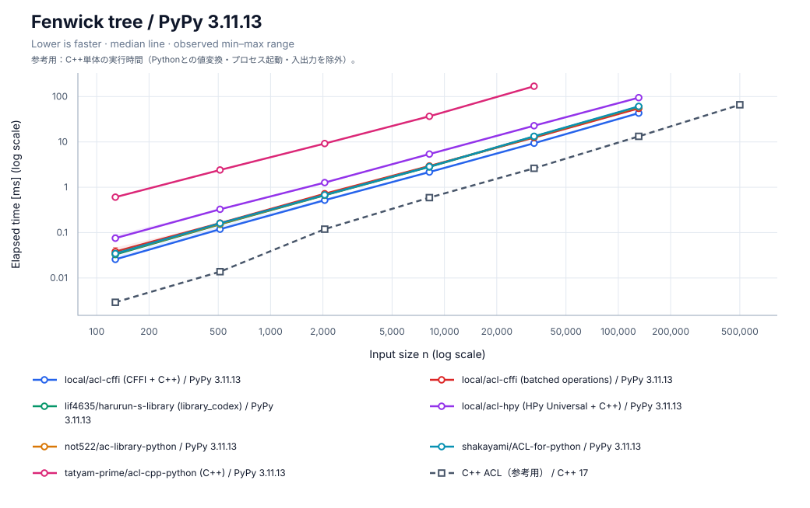

#### 全ケース中の最大中央値（タイムアウトした系列は除外）

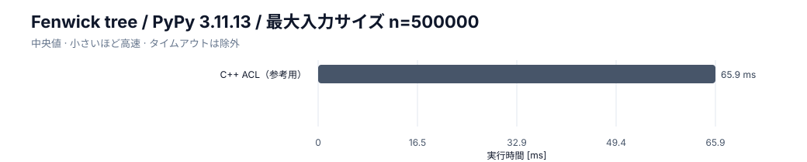

[折れ線 SVG を保存](charts/fenwicktree/pypy.svg) · [全ケースの最大値 SVG を保存](charts/fenwicktree/pypy-max.svg)

**参考用：C++単体の実行時間（Pythonとの値変換・プロセス起動・入出力を除外）。**

- C++ ACL（参考用）: 2026-09-28T08:26:25.744732+00:00; g++ \(Ubuntu 13.3.0-6ubuntu2~24.04.1\) 13.3.0 \| -std=c++17 -O3 -DNDEBUG -march=native; timeout n=\[\]

### 計測情報

| ランタイム | 計測日時 | CPU | repeat / warmup / seed | JSON |
| --- | --- | --- | --- | --- |
| PyPy 3.11.13 | 2026-09-28T08:04:00.284901+00:00 | AMD EPYC 9V45 96-Core Processor | 5 / 3 / 42 | [data](data/pypy/fenwicktree.json) |

- PyPy 3.11.13: commit `5550561a437a3f40e36638539da6e5e17797929e`; OS: Linux-6.17.0-1022-azure-x86\_64-with-glibc2.39
  - n=\[128, 512, 2048, 8192, 32768, 131072, 500000\]; warmup_seconds=0.25; sample_seconds=0.025
  - build: 3.11.13 \(413c9b7f57f5, Jul 03 2025, 18:03:56\) \[PyPy 7.3.20 with GCC 10.2.1 20210130 \(Red Hat 10.2.1-11\)\]
  - cffi: https://github.com/atcoder/ac-library.git @ `864245a00b00dd008d1abfdc239618fdb7d139da`
  - harurun: https://github.com/lif4635/harurun-s-library.git @ `7c94b7bb0c9d4f6ed0ffa44853febee1e7971ff9`
  - hpy: https://github.com/atcoder/ac-library.git @ `864245a00b00dd008d1abfdc239618fdb7d139da`
  - not522: https://github.com/not522/ac-library-python.git @ `27fdbb71cd0d566bdeb12746db59c9d908c6b5d5`
  - shakayami: https://github.com/shakayami/ACL-for-python.git @ `880ed3fc236c9628d674363768bcf203fbb84a8d`
  - tatyam: https://github.com/tatyam-prime/acl-cpp-python.git @ `b677fa437bdc1b0b7a4512d360de065cdca5778c`

## Floor sum

n 回の floor\_sum 呼び出し。引数 n,m は 1..999999、a,b は 0..999999。結果は符号付き 64 bit 以内。

### PyPy 3.11.13

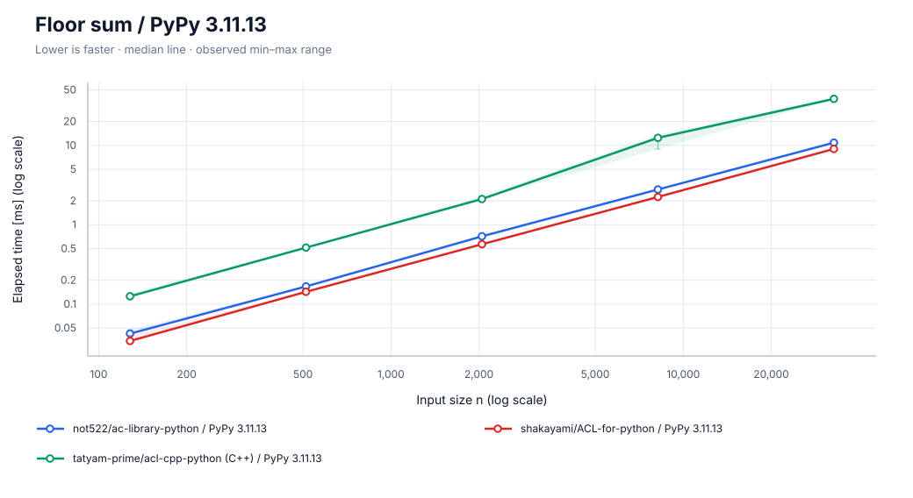

#### 全ケース中の最大中央値（タイムアウトした系列は除外）

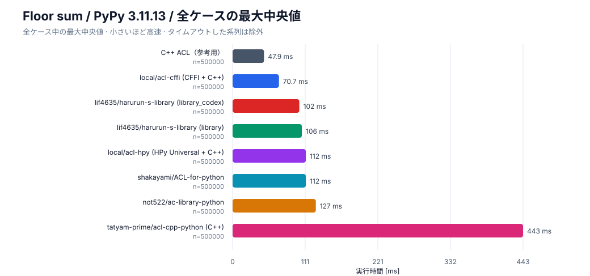

[折れ線 SVG を保存](charts/floor_sum/pypy.svg) · [全ケースの最大値 SVG を保存](charts/floor_sum/pypy-max.svg)

**参考用：C++単体の実行時間（Pythonとの値変換・プロセス起動・入出力を除外）。**

- C++ ACL（参考用）: 2026-09-28T08:26:29.214403+00:00; g++ \(Ubuntu 13.3.0-6ubuntu2~24.04.1\) 13.3.0 \| -std=c++17 -O3 -DNDEBUG -march=native; timeout n=\[\]

### 計測情報

| ランタイム | 計測日時 | CPU | repeat / warmup / seed | JSON |
| --- | --- | --- | --- | --- |
| PyPy 3.11.13 | 2026-09-28T08:04:50.188943+00:00 | AMD EPYC 9V45 96-Core Processor | 5 / 3 / 42 | [data](data/pypy/floor_sum.json) |

- PyPy 3.11.13: commit `5550561a437a3f40e36638539da6e5e17797929e`; OS: Linux-6.17.0-1022-azure-x86\_64-with-glibc2.39
  - n=\[128, 512, 2048, 8192, 32768, 131072, 500000\]; warmup_seconds=0.25; sample_seconds=0.025
  - build: 3.11.13 \(413c9b7f57f5, Jul 03 2025, 18:03:56\) \[PyPy 7.3.20 with GCC 10.2.1 20210130 \(Red Hat 10.2.1-11\)\]
  - cffi: https://github.com/atcoder/ac-library.git @ `864245a00b00dd008d1abfdc239618fdb7d139da`
  - harurun: https://github.com/lif4635/harurun-s-library.git @ `7c94b7bb0c9d4f6ed0ffa44853febee1e7971ff9`
  - hpy: https://github.com/atcoder/ac-library.git @ `864245a00b00dd008d1abfdc239618fdb7d139da`
  - not522: https://github.com/not522/ac-library-python.git @ `27fdbb71cd0d566bdeb12746db59c9d908c6b5d5`
  - shakayami: https://github.com/shakayami/ACL-for-python.git @ `880ed3fc236c9628d674363768bcf203fbb84a8d`
  - tatyam: https://github.com/tatyam-prime/acl-cpp-python.git @ `b677fa437bdc1b0b7a4512d360de065cdca5778c`

## Lazy segment tree

n 要素・2n 回の区間加算 / 区間和。\(合計, 要素数\) を保持し構築も計測。C++ 版には公開 API がないため Python 2 実装を比較。

### PyPy 3.11.13

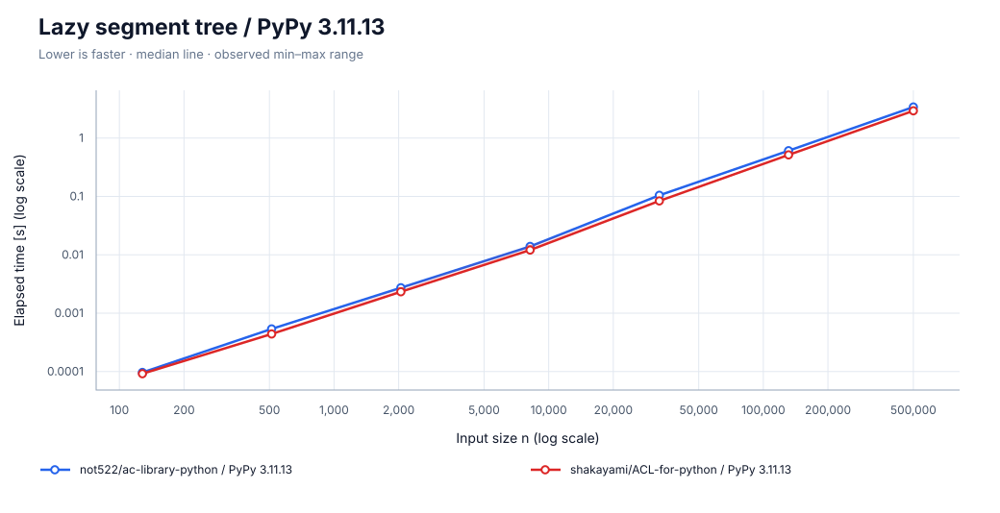

#### 全ケース中の最大中央値（タイムアウトした系列は除外）

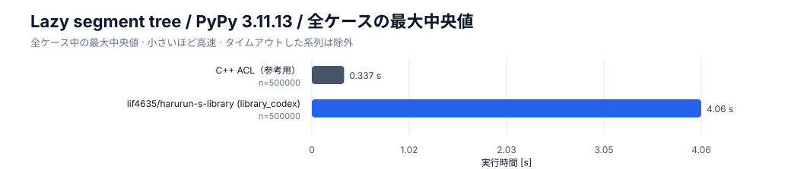

[折れ線 SVG を保存](charts/lazysegtree/pypy.svg) · [全ケースの最大値 SVG を保存](charts/lazysegtree/pypy-max.svg)

タイムアウト（グラフから除外）: cffi n=500000

**参考用：C++単体の実行時間（Pythonとの値変換・プロセス起動・入出力を除外）。**

- C++ ACL（参考用）: 2026-09-28T08:26:35.818294+00:00; g++ \(Ubuntu 13.3.0-6ubuntu2~24.04.1\) 13.3.0 \| -std=c++17 -O3 -DNDEBUG -march=native; timeout n=\[\]

### 計測情報

| ランタイム | 計測日時 | CPU | repeat / warmup / seed | JSON |
| --- | --- | --- | --- | --- |
| PyPy 3.11.13 | 2026-09-28T08:08:52.005965+00:00 | AMD EPYC 9V45 96-Core Processor | 5 / 3 / 42 | [data](data/pypy/lazysegtree.json) |

- PyPy 3.11.13: commit `5550561a437a3f40e36638539da6e5e17797929e`; OS: Linux-6.17.0-1022-azure-x86\_64-with-glibc2.39
  - n=\[128, 512, 2048, 8192, 32768, 131072, 500000\]; warmup_seconds=0.25; sample_seconds=0.025
  - build: 3.11.13 \(413c9b7f57f5, Jul 03 2025, 18:03:56\) \[PyPy 7.3.20 with GCC 10.2.1 20210130 \(Red Hat 10.2.1-11\)\]
  - cffi: https://github.com/atcoder/ac-library.git @ `864245a00b00dd008d1abfdc239618fdb7d139da`
  - harurun: https://github.com/lif4635/harurun-s-library.git @ `7c94b7bb0c9d4f6ed0ffa44853febee1e7971ff9`
  - not522: https://github.com/not522/ac-library-python.git @ `27fdbb71cd0d566bdeb12746db59c9d908c6b5d5`
  - shakayami: https://github.com/shakayami/ACL-for-python.git @ `880ed3fc236c9628d674363768bcf203fbb84a8d`

## LCP array

長さ n の ASCII 文字列と計測外で生成した suffix array から LCP を計算。

### PyPy 3.11.13

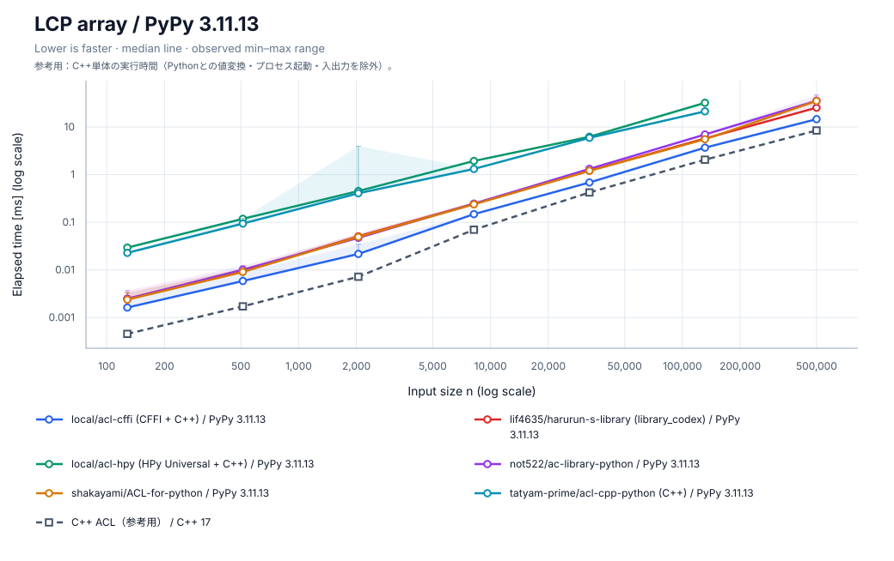

#### 全ケース中の最大中央値（タイムアウトした系列は除外）

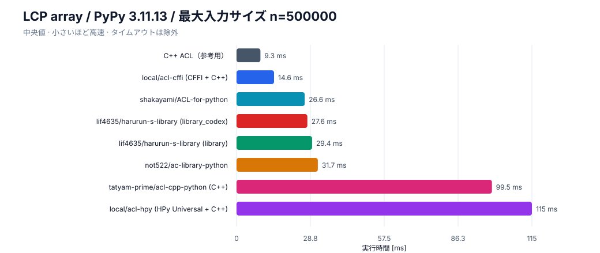

[折れ線 SVG を保存](charts/lcp_array/pypy.svg) · [全ケースの最大値 SVG を保存](charts/lcp_array/pypy-max.svg)

**参考用：C++単体の実行時間（Pythonとの値変換・プロセス起動・入出力を除外）。**

- C++ ACL（参考用）: 2026-09-28T08:26:41.256367+00:00; g++ \(Ubuntu 13.3.0-6ubuntu2~24.04.1\) 13.3.0 \| -std=c++17 -O3 -DNDEBUG -march=native; timeout n=\[\]

### 計測情報

| ランタイム | 計測日時 | CPU | repeat / warmup / seed | JSON |
| --- | --- | --- | --- | --- |
| PyPy 3.11.13 | 2026-09-28T08:09:36.641517+00:00 | AMD EPYC 9V45 96-Core Processor | 5 / 3 / 42 | [data](data/pypy/lcp_array.json) |

- PyPy 3.11.13: commit `5550561a437a3f40e36638539da6e5e17797929e`; OS: Linux-6.17.0-1022-azure-x86\_64-with-glibc2.39
  - n=\[128, 512, 2048, 8192, 32768, 131072, 500000\]; warmup_seconds=0.25; sample_seconds=0.025
  - build: 3.11.13 \(413c9b7f57f5, Jul 03 2025, 18:03:56\) \[PyPy 7.3.20 with GCC 10.2.1 20210130 \(Red Hat 10.2.1-11\)\]
  - cffi: https://github.com/atcoder/ac-library.git @ `864245a00b00dd008d1abfdc239618fdb7d139da`
  - harurun: https://github.com/lif4635/harurun-s-library.git @ `7c94b7bb0c9d4f6ed0ffa44853febee1e7971ff9`
  - hpy: https://github.com/atcoder/ac-library.git @ `864245a00b00dd008d1abfdc239618fdb7d139da`
  - not522: https://github.com/not522/ac-library-python.git @ `27fdbb71cd0d566bdeb12746db59c9d908c6b5d5`
  - shakayami: https://github.com/shakayami/ACL-for-python.git @ `880ed3fc236c9628d674363768bcf203fbb84a8d`
  - tatyam: https://github.com/tatyam-prime/acl-cpp-python.git @ `b677fa437bdc1b0b7a4512d360de065cdca5778c`

## Maximum flow

左右 n 頂点ずつの疎な二部グラフ。各左頂点から 4 辺。ネットワーク構築と最大流を計測。

### PyPy 3.11.13

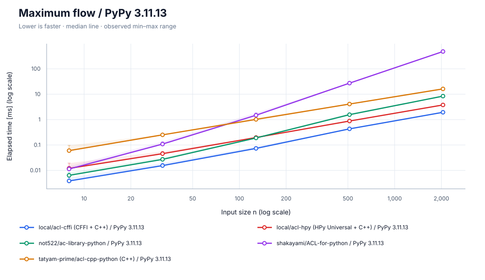

#### 全ケース中の最大中央値（タイムアウトした系列は除外）

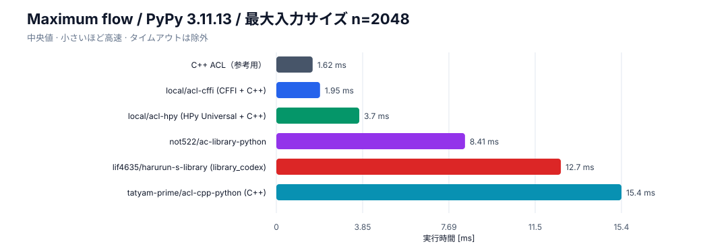

[折れ線 SVG を保存](charts/maxflow/pypy.svg) · [全ケースの最大値 SVG を保存](charts/maxflow/pypy-max.svg)

**参考用：C++単体の実行時間（Pythonとの値変換・プロセス起動・入出力を除外）。**

- C++ ACL（参考用）: 2026-09-28T08:26:43.119229+00:00; g++ \(Ubuntu 13.3.0-6ubuntu2~24.04.1\) 13.3.0 \| -std=c++17 -O3 -DNDEBUG -march=native; timeout n=\[\]

### 計測情報

| ランタイム | 計測日時 | CPU | repeat / warmup / seed | JSON |
| --- | --- | --- | --- | --- |
| PyPy 3.11.13 | 2026-09-28T08:09:55.795033+00:00 | AMD EPYC 9V45 96-Core Processor | 5 / 3 / 42 | [data](data/pypy/maxflow.json) |

- PyPy 3.11.13: commit `5550561a437a3f40e36638539da6e5e17797929e`; OS: Linux-6.17.0-1022-azure-x86\_64-with-glibc2.39
  - n=\[8, 32, 128, 512, 2048\]; warmup_seconds=0.25; sample_seconds=0.025
  - build: 3.11.13 \(413c9b7f57f5, Jul 03 2025, 18:03:56\) \[PyPy 7.3.20 with GCC 10.2.1 20210130 \(Red Hat 10.2.1-11\)\]
  - cffi: https://github.com/atcoder/ac-library.git @ `864245a00b00dd008d1abfdc239618fdb7d139da`
  - harurun: https://github.com/lif4635/harurun-s-library.git @ `7c94b7bb0c9d4f6ed0ffa44853febee1e7971ff9`
  - hpy: https://github.com/atcoder/ac-library.git @ `864245a00b00dd008d1abfdc239618fdb7d139da`
  - not522: https://github.com/not522/ac-library-python.git @ `27fdbb71cd0d566bdeb12746db59c9d908c6b5d5`
  - shakayami: https://github.com/shakayami/ACL-for-python.git @ `880ed3fc236c9628d674363768bcf203fbb84a8d`
  - tatyam: https://github.com/tatyam-prime/acl-cpp-python.git @ `b677fa437bdc1b0b7a4512d360de065cdca5778c`

## Minimum-cost flow

左右 n 頂点ずつの二部グラフ。各左頂点から 3 辺、非負コスト。構築と最小費用最大流を計測。

### PyPy 3.11.13

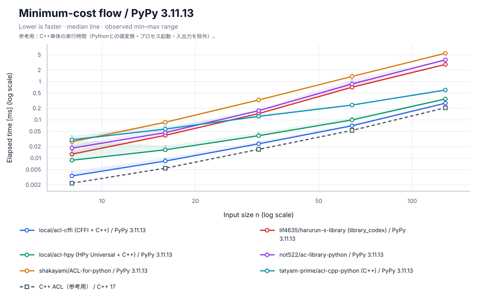

#### 全ケース中の最大中央値（タイムアウトした系列は除外）

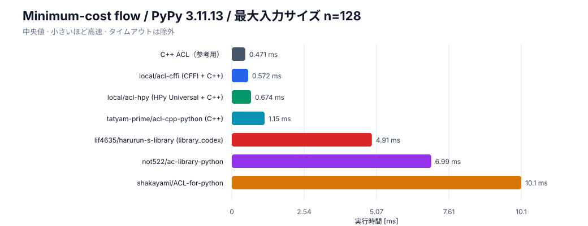

[折れ線 SVG を保存](charts/mincostflow/pypy.svg) · [全ケースの最大値 SVG を保存](charts/mincostflow/pypy-max.svg)

**参考用：C++単体の実行時間（Pythonとの値変換・プロセス起動・入出力を除外）。**

- C++ ACL（参考用）: 2026-09-28T08:26:44.985803+00:00; g++ \(Ubuntu 13.3.0-6ubuntu2~24.04.1\) 13.3.0 \| -std=c++17 -O3 -DNDEBUG -march=native; timeout n=\[\]

### 計測情報

| ランタイム | 計測日時 | CPU | repeat / warmup / seed | JSON |
| --- | --- | --- | --- | --- |
| PyPy 3.11.13 | 2026-09-28T08:10:12.757154+00:00 | AMD EPYC 9V45 96-Core Processor | 5 / 3 / 42 | [data](data/pypy/mincostflow.json) |

- PyPy 3.11.13: commit `5550561a437a3f40e36638539da6e5e17797929e`; OS: Linux-6.17.0-1022-azure-x86\_64-with-glibc2.39
  - n=\[8, 16, 32, 64, 128\]; warmup_seconds=0.25; sample_seconds=0.025
  - build: 3.11.13 \(413c9b7f57f5, Jul 03 2025, 18:03:56\) \[PyPy 7.3.20 with GCC 10.2.1 20210130 \(Red Hat 10.2.1-11\)\]
  - cffi: https://github.com/atcoder/ac-library.git @ `864245a00b00dd008d1abfdc239618fdb7d139da`
  - harurun: https://github.com/lif4635/harurun-s-library.git @ `7c94b7bb0c9d4f6ed0ffa44853febee1e7971ff9`
  - hpy: https://github.com/atcoder/ac-library.git @ `864245a00b00dd008d1abfdc239618fdb7d139da`
  - not522: https://github.com/not522/ac-library-python.git @ `27fdbb71cd0d566bdeb12746db59c9d908c6b5d5`
  - shakayami: https://github.com/shakayami/ACL-for-python.git @ `880ed3fc236c9628d674363768bcf203fbb84a8d`
  - tatyam: https://github.com/tatyam-prime/acl-cpp-python.git @ `b677fa437bdc1b0b7a4512d360de065cdca5778c`

## Ordered Set \(Library Checker\)

公式の37入力。挿入・削除・1始まりのk番目・x以下の個数・前後要素。初期構築と全クエリを計測。棒グラフに最も遅いケース名を表示。

### PyPy 3.11.13

#### 全ケース中の最大中央値（タイムアウトした系列は除外）

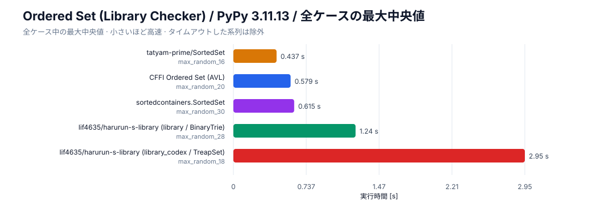

[全ケースの最大値 SVG を保存](charts/ordered_set/pypy-max.svg)

### 計測情報

| ランタイム | 計測日時 | CPU | repeat / warmup / seed | JSON |
| --- | --- | --- | --- | --- |
| PyPy 3.11.13 | 2026-09-28T08:19:05.117814+00:00 | AMD EPYC 9V45 96-Core Processor | 5 / 1 / 42 | [data](data/pypy/ordered_set.json) |

- PyPy 3.11.13: commit `5550561a437a3f40e36638539da6e5e17797929e`; OS: Linux-6.17.0-1022-azure-x86\_64-with-glibc2.39
  - n=\[1, 2, 3, 4, 5, 6, 7, 8, 9, 10, 11, 12, 13, 14, 15, 16, 17, 18, 19, 20, 21, 22, 23, 24, 25, 26, 27, 28, 29, 30, 31, 32, 33, 34, 35, 36, 37\]; warmup_seconds=0.1; sample_seconds=0.025
  - build: 3.11.13 \(413c9b7f57f5, Jul 03 2025, 18:03:56\) \[PyPy 7.3.20 with GCC 10.2.1 20210130 \(Red Hat 10.2.1-11\)\]
  - cffi: https://github.com/atcoder/ac-library.git @ `864245a00b00dd008d1abfdc239618fdb7d139da`
  - harurun: https://github.com/lif4635/harurun-s-library.git @ `7c94b7bb0c9d4f6ed0ffa44853febee1e7971ff9`
  - sortedcontainers: https://github.com/grantjenks/python-sortedcontainers.git @ `3ac358631f58c1347f1d6d2d92784117db0f38ed`
  - tatyam\_sortedset: https://github.com/tatyam-prime/SortedSet.git @ `9a205c686c225c2b083c4852516da34a6ca1f4c2`
  - yosupo\_ordered\_set: https://github.com/yosupo06/library-checker-problems.git @ `1814c4e5205517e368bb57a8d1127eb961cfeaae`

## Strongly connected components

n 頂点・4n 辺。小さいブロック内の辺と前方への辺を混在。グラフ構築と結果の正規化も計測。

### PyPy 3.11.13

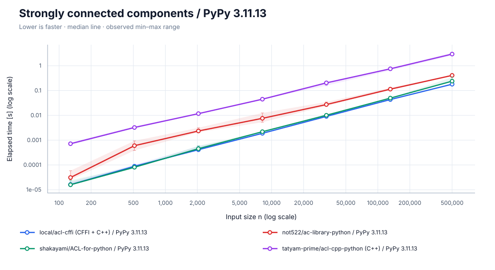

#### 全ケース中の最大中央値（タイムアウトした系列は除外）

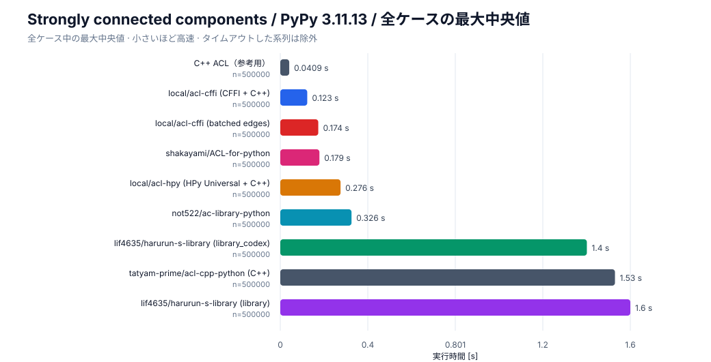

[折れ線 SVG を保存](charts/scc/pypy.svg) · [全ケースの最大値 SVG を保存](charts/scc/pypy-max.svg)

**参考用：C++単体の実行時間（Pythonとの値変換・プロセス起動・入出力を除外）。**

- C++ ACL（参考用）: 2026-09-28T08:26:50.428826+00:00; g++ \(Ubuntu 13.3.0-6ubuntu2~24.04.1\) 13.3.0 \| -std=c++17 -O3 -DNDEBUG -march=native; timeout n=\[\]

### 計測情報

| ランタイム | 計測日時 | CPU | repeat / warmup / seed | JSON |
| --- | --- | --- | --- | --- |
| PyPy 3.11.13 | 2026-09-28T08:21:14.388497+00:00 | AMD EPYC 9V45 96-Core Processor | 5 / 3 / 42 | [data](data/pypy/scc.json) |

- PyPy 3.11.13: commit `5550561a437a3f40e36638539da6e5e17797929e`; OS: Linux-6.17.0-1022-azure-x86\_64-with-glibc2.39
  - n=\[128, 512, 2048, 8192, 32768, 131072, 500000\]; warmup_seconds=0.25; sample_seconds=0.025
  - build: 3.11.13 \(413c9b7f57f5, Jul 03 2025, 18:03:56\) \[PyPy 7.3.20 with GCC 10.2.1 20210130 \(Red Hat 10.2.1-11\)\]
  - cffi: https://github.com/atcoder/ac-library.git @ `864245a00b00dd008d1abfdc239618fdb7d139da`
  - harurun: https://github.com/lif4635/harurun-s-library.git @ `7c94b7bb0c9d4f6ed0ffa44853febee1e7971ff9`
  - hpy: https://github.com/atcoder/ac-library.git @ `864245a00b00dd008d1abfdc239618fdb7d139da`
  - not522: https://github.com/not522/ac-library-python.git @ `27fdbb71cd0d566bdeb12746db59c9d908c6b5d5`
  - shakayami: https://github.com/shakayami/ACL-for-python.git @ `880ed3fc236c9628d674363768bcf203fbb84a8d`
  - tatyam: https://github.com/tatyam-prime/acl-cpp-python.git @ `b677fa437bdc1b0b7a4512d360de065cdca5778c`

## Segment tree

n 要素・4n 回の一点更新 / 区間和。構築も計測。C++ 版には公開 API がないため Python 2 実装を比較。

### PyPy 3.11.13

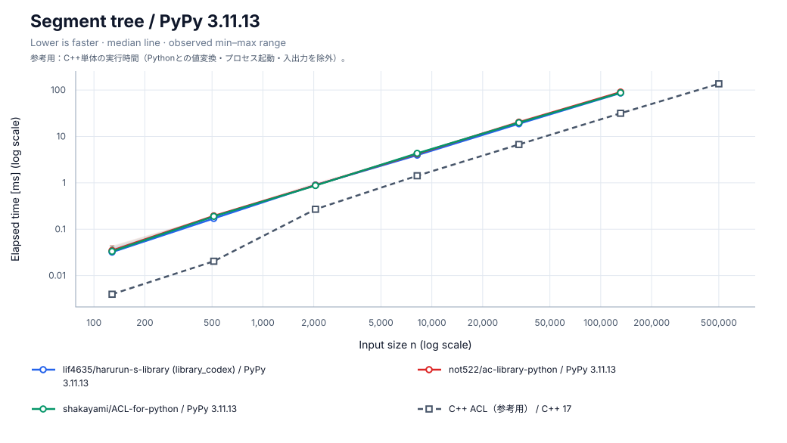

#### 全ケース中の最大中央値（タイムアウトした系列は除外）

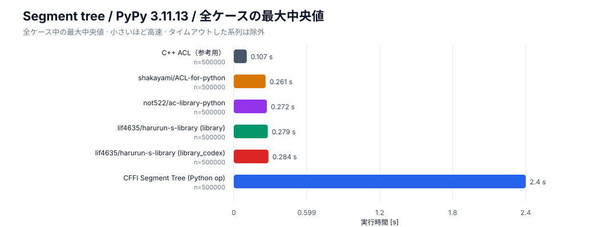

[折れ線 SVG を保存](charts/segtree/pypy.svg) · [全ケースの最大値 SVG を保存](charts/segtree/pypy-max.svg)

**参考用：C++単体の実行時間（Pythonとの値変換・プロセス起動・入出力を除外）。**

- C++ ACL（参考用）: 2026-09-28T08:26:56.022931+00:00; g++ \(Ubuntu 13.3.0-6ubuntu2~24.04.1\) 13.3.0 \| -std=c++17 -O3 -DNDEBUG -march=native; timeout n=\[\]

### 計測情報

| ランタイム | 計測日時 | CPU | repeat / warmup / seed | JSON |
| --- | --- | --- | --- | --- |
| PyPy 3.11.13 | 2026-09-28T08:22:42.202306+00:00 | AMD EPYC 9V45 96-Core Processor | 5 / 3 / 42 | [data](data/pypy/segtree.json) |

- PyPy 3.11.13: commit `5550561a437a3f40e36638539da6e5e17797929e`; OS: Linux-6.17.0-1022-azure-x86\_64-with-glibc2.39
  - n=\[128, 512, 2048, 8192, 32768, 131072, 500000\]; warmup_seconds=0.25; sample_seconds=0.025
  - build: 3.11.13 \(413c9b7f57f5, Jul 03 2025, 18:03:56\) \[PyPy 7.3.20 with GCC 10.2.1 20210130 \(Red Hat 10.2.1-11\)\]
  - cffi: https://github.com/atcoder/ac-library.git @ `864245a00b00dd008d1abfdc239618fdb7d139da`
  - harurun: https://github.com/lif4635/harurun-s-library.git @ `7c94b7bb0c9d4f6ed0ffa44853febee1e7971ff9`
  - not522: https://github.com/not522/ac-library-python.git @ `27fdbb71cd0d566bdeb12746db59c9d908c6b5d5`
  - shakayami: https://github.com/shakayami/ACL-for-python.git @ `880ed3fc236c9628d674363768bcf203fbb84a8d`

## Suffix array

長さ n の ASCII 文字列の suffix array。Python/C++ 間の変換も含む。

### PyPy 3.11.13

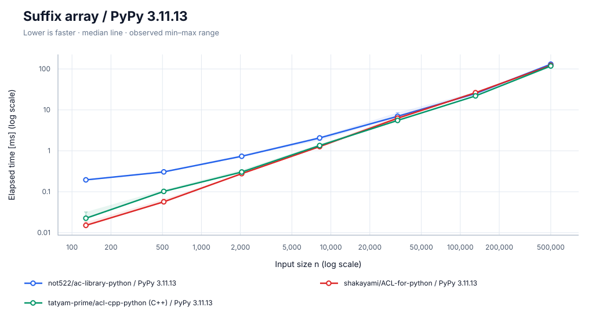

#### 全ケース中の最大中央値（タイムアウトした系列は除外）

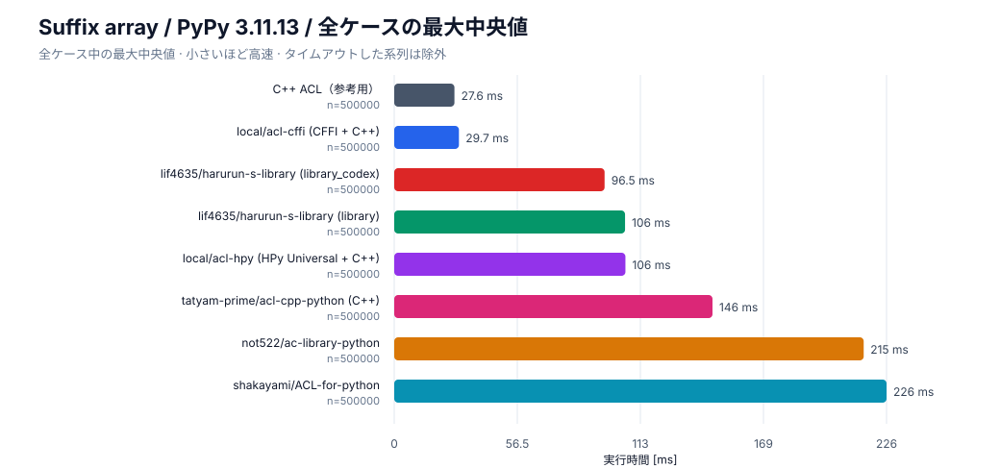

[折れ線 SVG を保存](charts/suffix_array/pypy.svg) · [全ケースの最大値 SVG を保存](charts/suffix_array/pypy-max.svg)

**参考用：C++単体の実行時間（Pythonとの値変換・プロセス起動・入出力を除外）。**

- C++ ACL（参考用）: 2026-09-28T08:26:58.898273+00:00; g++ \(Ubuntu 13.3.0-6ubuntu2~24.04.1\) 13.3.0 \| -std=c++17 -O3 -DNDEBUG -march=native; timeout n=\[\]

### 計測情報

| ランタイム | 計測日時 | CPU | repeat / warmup / seed | JSON |
| --- | --- | --- | --- | --- |
| PyPy 3.11.13 | 2026-09-28T08:23:17.492745+00:00 | AMD EPYC 9V45 96-Core Processor | 5 / 3 / 42 | [data](data/pypy/suffix_array.json) |

- PyPy 3.11.13: commit `5550561a437a3f40e36638539da6e5e17797929e`; OS: Linux-6.17.0-1022-azure-x86\_64-with-glibc2.39
  - n=\[128, 512, 2048, 8192, 32768, 131072, 500000\]; warmup_seconds=0.25; sample_seconds=0.025
  - build: 3.11.13 \(413c9b7f57f5, Jul 03 2025, 18:03:56\) \[PyPy 7.3.20 with GCC 10.2.1 20210130 \(Red Hat 10.2.1-11\)\]
  - cffi: https://github.com/atcoder/ac-library.git @ `864245a00b00dd008d1abfdc239618fdb7d139da`
  - harurun: https://github.com/lif4635/harurun-s-library.git @ `7c94b7bb0c9d4f6ed0ffa44853febee1e7971ff9`
  - hpy: https://github.com/atcoder/ac-library.git @ `864245a00b00dd008d1abfdc239618fdb7d139da`
  - not522: https://github.com/not522/ac-library-python.git @ `27fdbb71cd0d566bdeb12746db59c9d908c6b5d5`
  - shakayami: https://github.com/shakayami/ACL-for-python.git @ `880ed3fc236c9628d674363768bcf203fbb84a8d`
  - tatyam: https://github.com/tatyam-prime/acl-cpp-python.git @ `b677fa437bdc1b0b7a4512d360de065cdca5778c`

## 2-SAT

n 変数・4n 節。充足可能なランダム式の構築と求解。返り値は充足可能性と解の整合性。

### PyPy 3.11.13

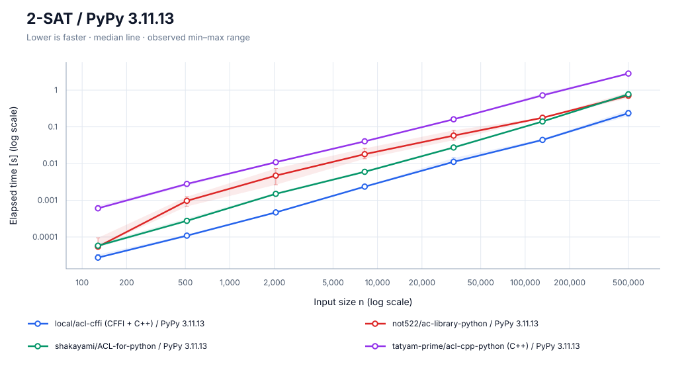

#### 全ケース中の最大中央値（タイムアウトした系列は除外）

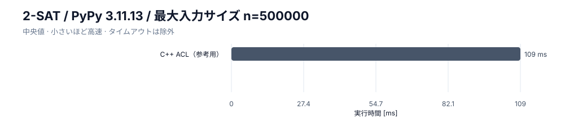

[折れ線 SVG を保存](charts/two_sat/pypy.svg) · [全ケースの最大値 SVG を保存](charts/two_sat/pypy-max.svg)

**参考用：C++単体の実行時間（Pythonとの値変換・プロセス起動・入出力を除外）。**

- C++ ACL（参考用）: 2026-09-28T08:27:05.556401+00:00; g++ \(Ubuntu 13.3.0-6ubuntu2~24.04.1\) 13.3.0 \| -std=c++17 -O3 -DNDEBUG -march=native; timeout n=\[\]

### 計測情報

| ランタイム | 計測日時 | CPU | repeat / warmup / seed | JSON |
| --- | --- | --- | --- | --- |
| PyPy 3.11.13 | 2026-09-28T08:25:35.582648+00:00 | AMD EPYC 9V45 96-Core Processor | 5 / 3 / 42 | [data](data/pypy/two_sat.json) |

- PyPy 3.11.13: commit `5550561a437a3f40e36638539da6e5e17797929e`; OS: Linux-6.17.0-1022-azure-x86\_64-with-glibc2.39
  - n=\[128, 512, 2048, 8192, 32768, 131072, 500000\]; warmup_seconds=0.25; sample_seconds=0.025
  - build: 3.11.13 \(413c9b7f57f5, Jul 03 2025, 18:03:56\) \[PyPy 7.3.20 with GCC 10.2.1 20210130 \(Red Hat 10.2.1-11\)\]
  - cffi: https://github.com/atcoder/ac-library.git @ `864245a00b00dd008d1abfdc239618fdb7d139da`
  - harurun: https://github.com/lif4635/harurun-s-library.git @ `7c94b7bb0c9d4f6ed0ffa44853febee1e7971ff9`
  - hpy: https://github.com/atcoder/ac-library.git @ `864245a00b00dd008d1abfdc239618fdb7d139da`
  - not522: https://github.com/not522/ac-library-python.git @ `27fdbb71cd0d566bdeb12746db59c9d908c6b5d5`
  - shakayami: https://github.com/shakayami/ACL-for-python.git @ `880ed3fc236c9628d674363768bcf203fbb84a8d`
  - tatyam: https://github.com/tatyam-prime/acl-cpp-python.git @ `b677fa437bdc1b0b7a4512d360de065cdca5778c`

## Z algorithm

長さ n の ASCII 文字列の Z 配列。Python/C++ 間の変換も含む。

### PyPy 3.11.13

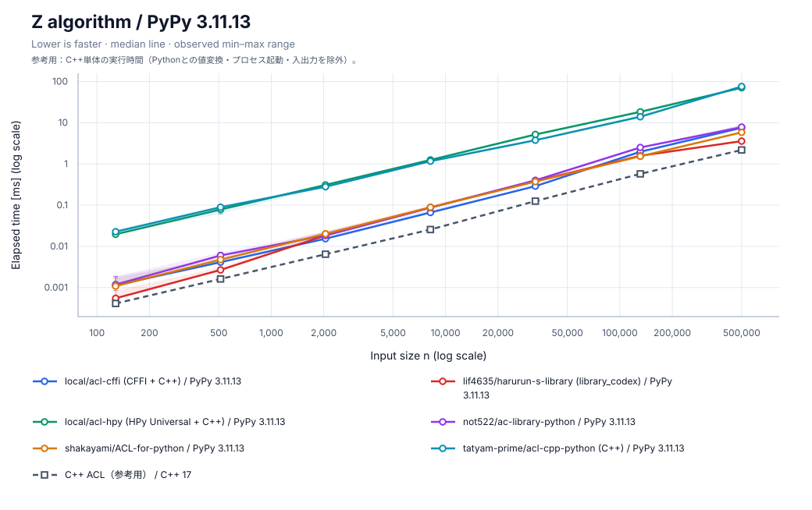

#### 全ケース中の最大中央値（タイムアウトした系列は除外）

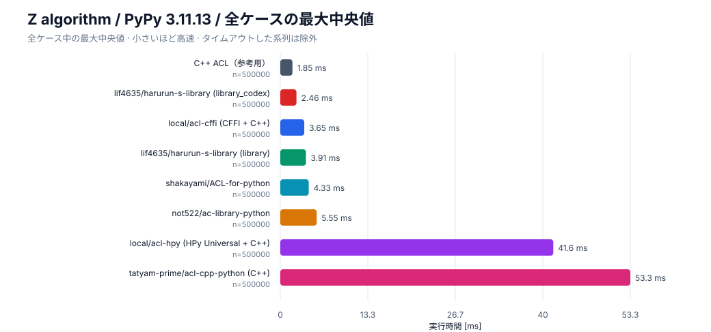

[折れ線 SVG を保存](charts/z_algorithm/pypy.svg) · [全ケースの最大値 SVG を保存](charts/z_algorithm/pypy-max.svg)

**参考用：C++単体の実行時間（Pythonとの値変換・プロセス起動・入出力を除外）。**

- C++ ACL（参考用）: 2026-09-28T08:27:08.218629+00:00; g++ \(Ubuntu 13.3.0-6ubuntu2~24.04.1\) 13.3.0 \| -std=c++17 -O3 -DNDEBUG -march=native; timeout n=\[\]

### 計測情報

| ランタイム | 計測日時 | CPU | repeat / warmup / seed | JSON |
| --- | --- | --- | --- | --- |
| PyPy 3.11.13 | 2026-09-28T08:26:07.359561+00:00 | AMD EPYC 9V45 96-Core Processor | 5 / 3 / 42 | [data](data/pypy/z_algorithm.json) |

- PyPy 3.11.13: commit `5550561a437a3f40e36638539da6e5e17797929e`; OS: Linux-6.17.0-1022-azure-x86\_64-with-glibc2.39
  - n=\[128, 512, 2048, 8192, 32768, 131072, 500000\]; warmup_seconds=0.25; sample_seconds=0.025
  - build: 3.11.13 \(413c9b7f57f5, Jul 03 2025, 18:03:56\) \[PyPy 7.3.20 with GCC 10.2.1 20210130 \(Red Hat 10.2.1-11\)\]
  - cffi: https://github.com/atcoder/ac-library.git @ `864245a00b00dd008d1abfdc239618fdb7d139da`
  - harurun: https://github.com/lif4635/harurun-s-library.git @ `7c94b7bb0c9d4f6ed0ffa44853febee1e7971ff9`
  - hpy: https://github.com/atcoder/ac-library.git @ `864245a00b00dd008d1abfdc239618fdb7d139da`
  - not522: https://github.com/not522/ac-library-python.git @ `27fdbb71cd0d566bdeb12746db59c9d908c6b5d5`
  - shakayami: https://github.com/shakayami/ACL-for-python.git @ `880ed3fc236c9628d674363768bcf203fbb84a8d`
  - tatyam: https://github.com/tatyam-prime/acl-cpp-python.git @ `b677fa437bdc1b0b7a4512d360de065cdca5778c`

CI の CPU・負荷・ランタイムのバージョンによって実行時間は変動します。増分計測ではケースやランタイムごとに計測日時が異なります。各グラフの計測情報と JSON を併せて確認してください。
